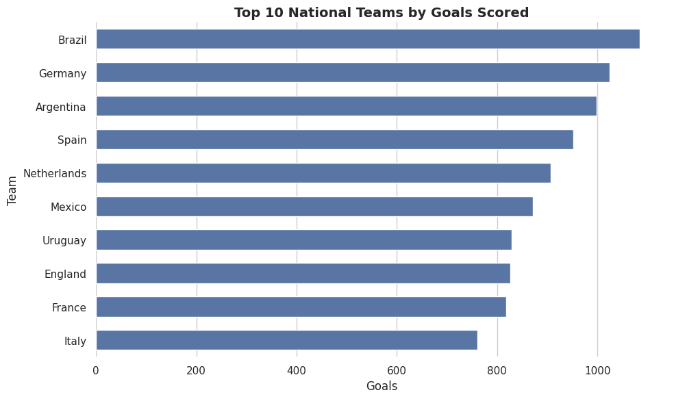
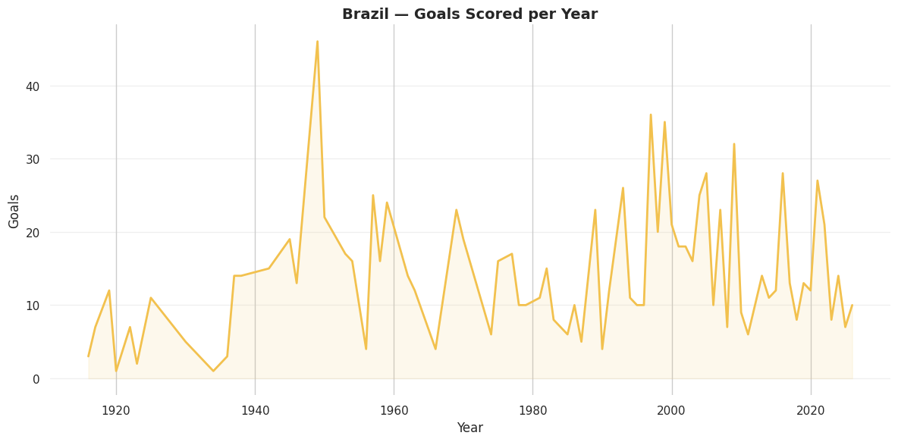
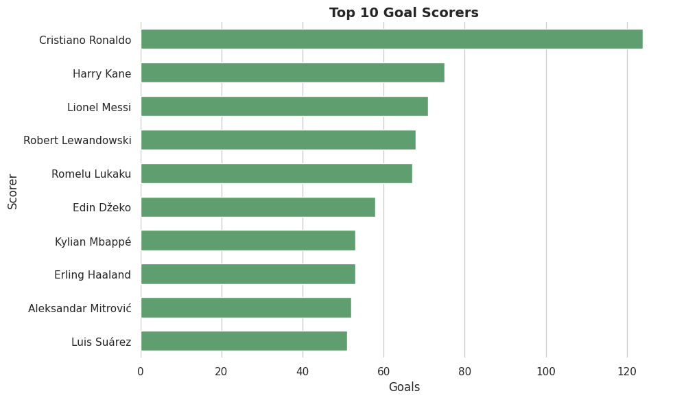
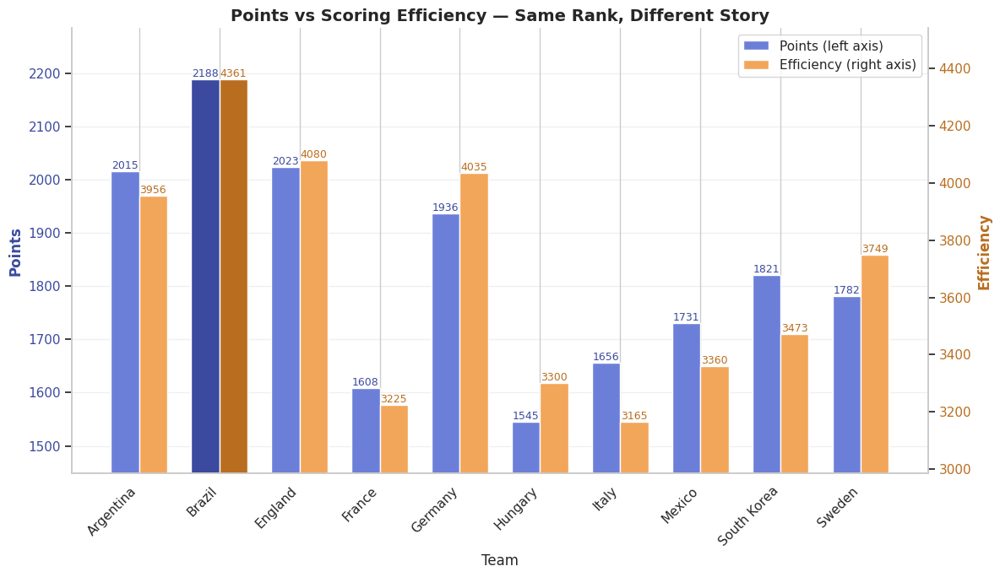
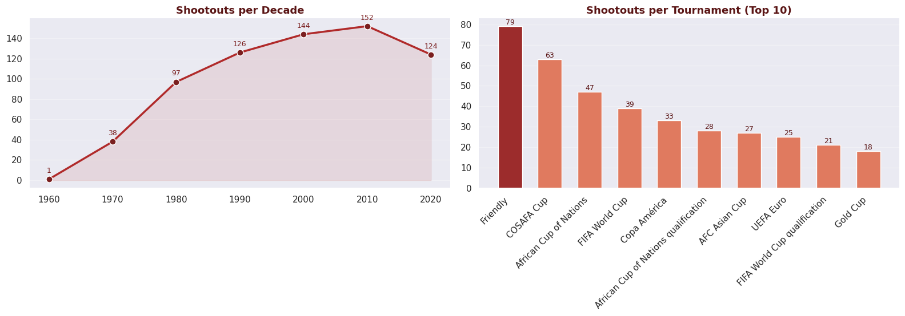
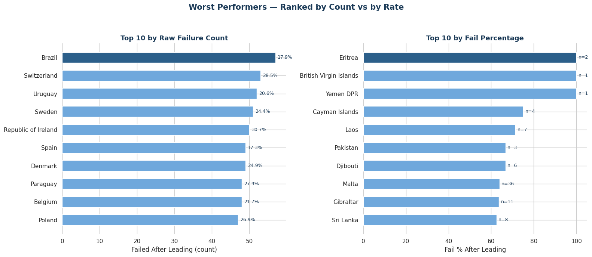
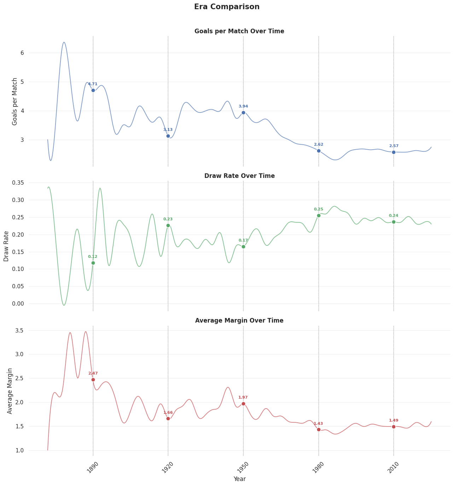

# Top 10 National Teams 
With brazil having two golden eras where it dominated football
first era (1946–1966) and second era (1994–2002), that still gives them ahead start while countries like argentina are  slowly building their way there with some of their recent years scoring over 20 goals consistently 

# Top 10 Scorers 
Even though brazil has the most goals , there is no brazilian in the top 10 scorers
the top goals scorer is Cristiano Ronaldo due to his scoring ability with both legs and head and also competing professionally since 2002 

# Top Efficiency  
While winning to score points or drawing to keep your team safe is a good method to gain points.
some teams take the risk and earn their rankings by goals clashing with other teams showing that football isn't always this bored technical game.
one of the examples is germany which has more efficiency than argentina even tho it gains less "3 1 0" pts .

# Drama Analysis 
Shootouts have increased steadily throughout decades which aligns with the idea that the sport have became more civilized / technical resulting in the teams playing the long game rather than competing to score more than goals. 

since not all tournaments / not every match in tournament that leads to most shootouts taking place in Friendly matches

# Worst Performers 
by raw numbers , brazil is the top team that have matches where they scored first then lost. but when looking at the big picture you realize such ranking can be tricky due to some teams being more active and more goal hungry that they end up failing in defending.

# Decades Comparison 
due to football becoming more technical with laws every year to make the keep the prevent some of the abusing techniques used
the avg number of goals have decayed significantly from 4-6 goals per match to below 3 goals.
draw rates stabilized with time to almost 0.25 since 1980.
avg margins between goals decreases heavily with time from 3 and above to currently 1 or 2 goals.teams 
winning with dominating score rather than keeping their lead became risky for most teams 

