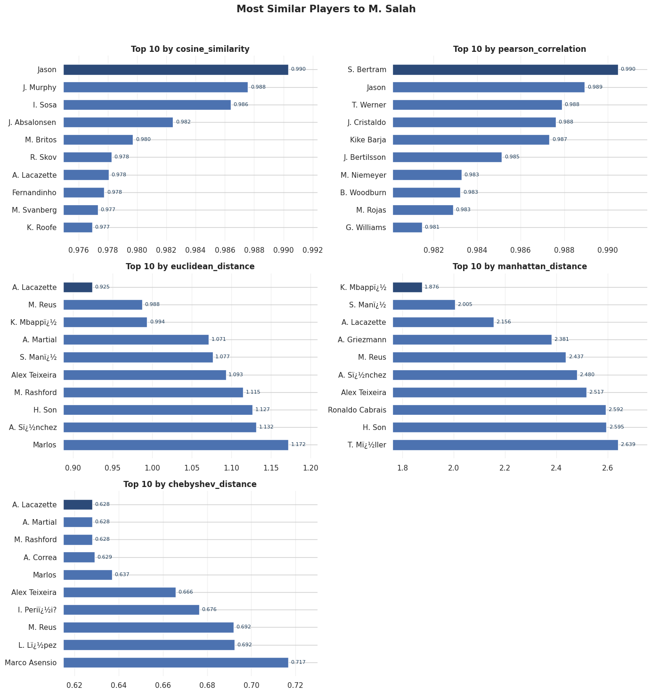
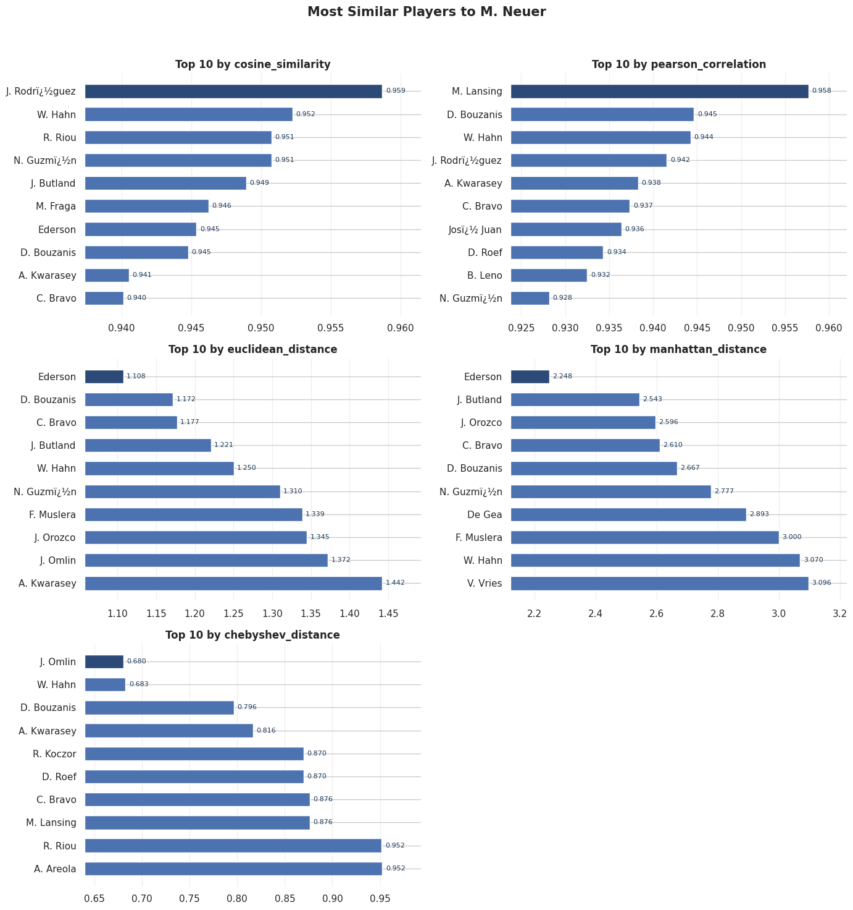
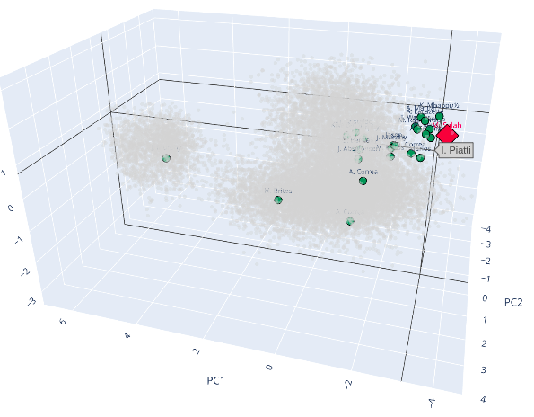
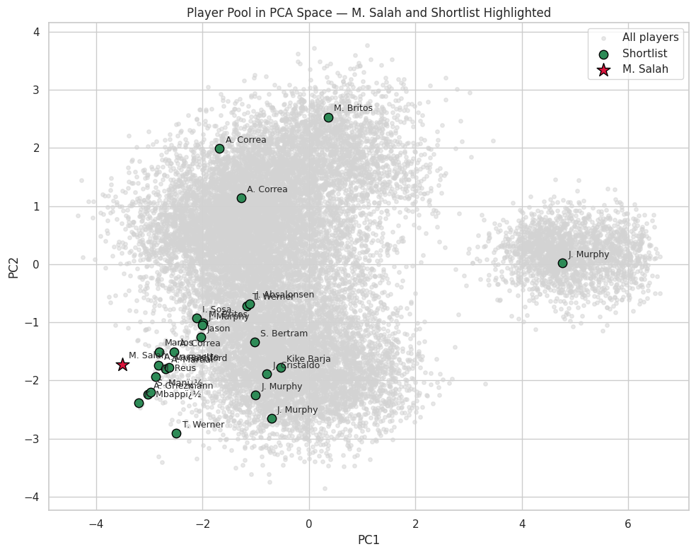

# Mo. Salah similar players  
i know nothing about football so according to AI about if they're attacking players

'Mostly, but not entirely. The recognizable names skew heavily toward forwards/wingers — Mbappé, Griezmann, Rashford, Son, Martial, Sánchez, Müller, Asensio, Werner, Lacazette are all attacking players similar to Salah's profile.

The clear exception is Fernandinho — he was a defensive midfielder for Manchester City and Brazil, not an attacker at all. His appearance in a "similar to Salah" list is a bit odd and suggests the similarity metric (probably built on stats like goals, assists, shots, etc.) can group players by stat profile rather than actual position/role — a holding mid with unusually high attacking output could still cluster near a winger numerically.''

-comments about each method are in the .ipynb-

# Neuer example 
Ai option : "this list makes total sense, since Neuer is a goalkeeper. All the recognizable names here are keepers: Ederson, Claudio Bravo, De Gea, Jack Butland, Alphonse Areola, Bernd Leno, Fernando Muslera, Jonas Omlin, Nery Guzmán/Guzmán, and Adam Kwarasey"

since we didn't even feed the model defensive features it observed the similarity between goalkeepers due to their lack of physical properties.

# PCA confirmation 
most of the names mentioned are clustered around Salah in the PCA 

for the neuer's case its more clean since all GK are clustered around it and they're far away in the 3D from the attackers