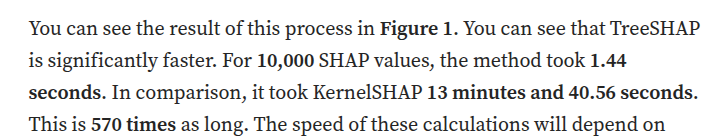
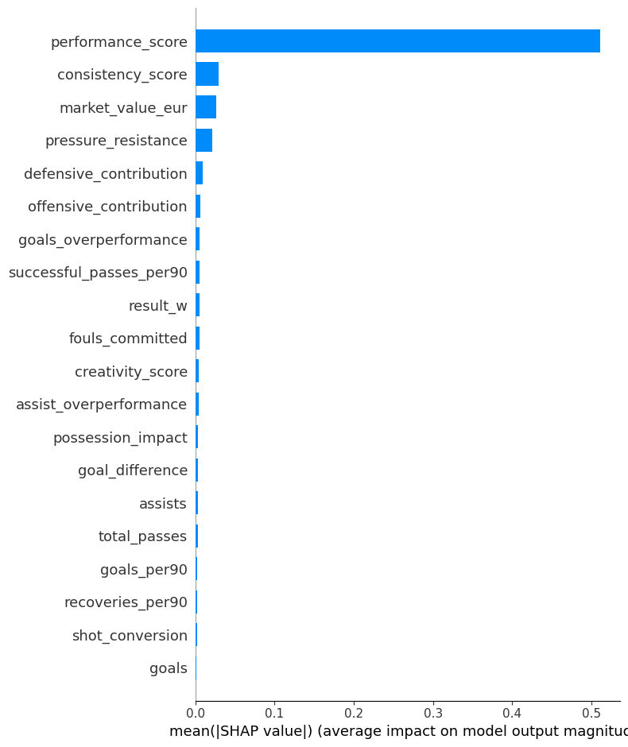
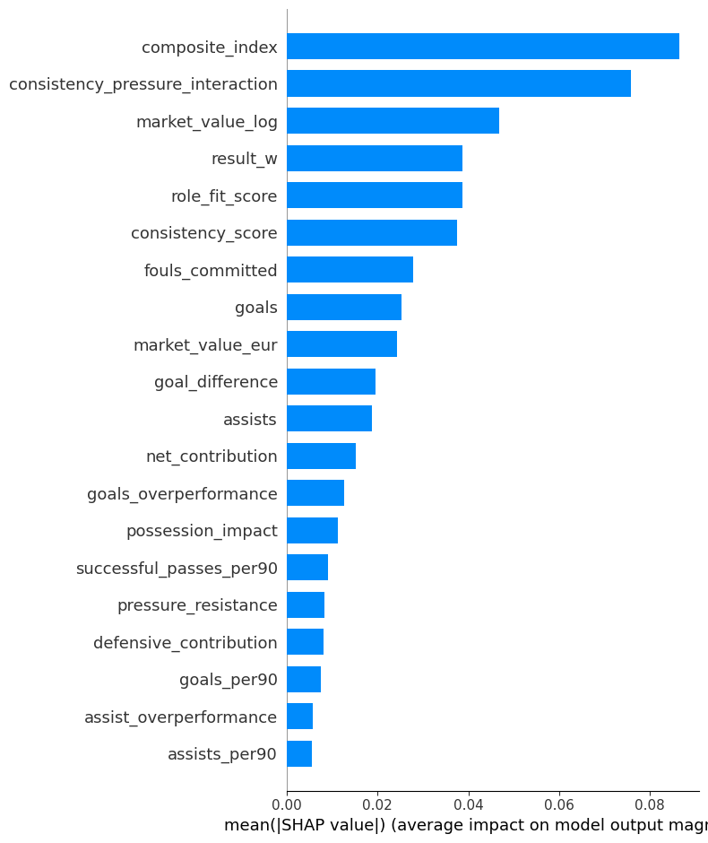
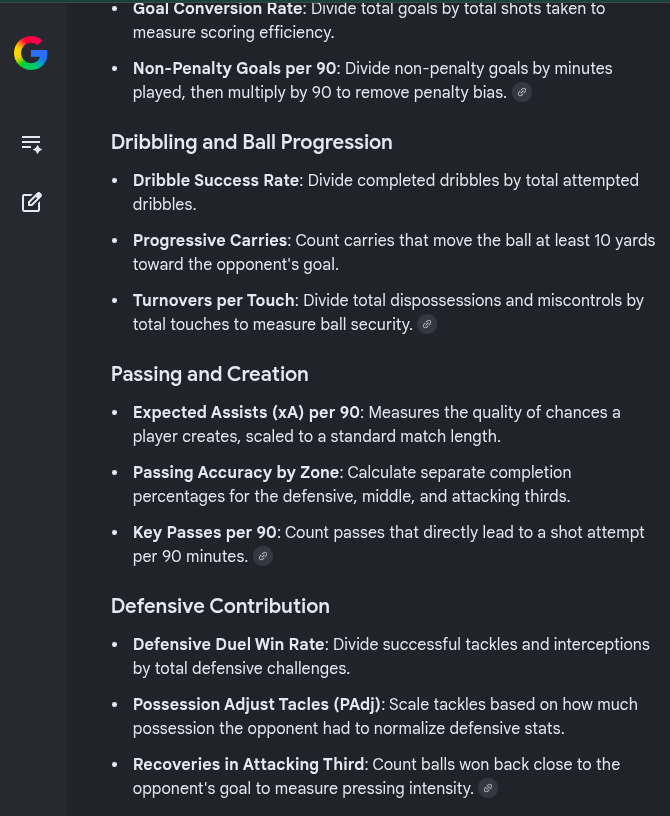
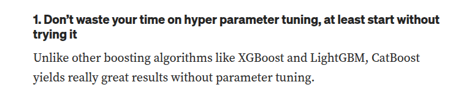
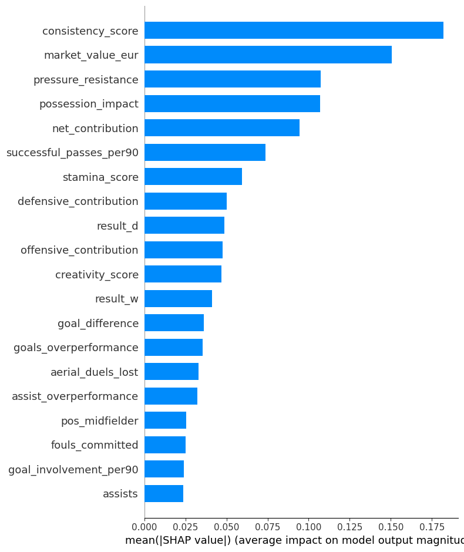
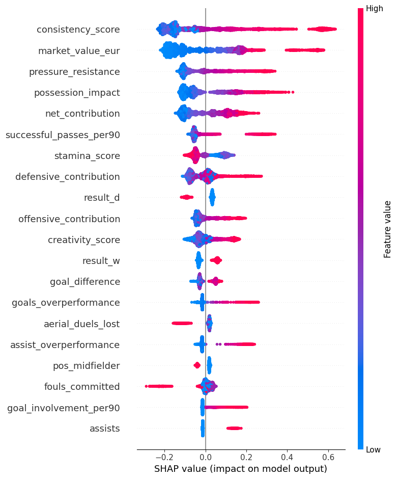
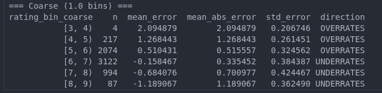

- **NOTE1** : as you can see from the github date , i already thought performance score was a leakage,i'll keep the documented lines before confirmation , and it the end i'll write the correct numerical values without leakage

- **NOTE22** : for a summery of the whole process : last header

## Data Exploring
### Basic Structure
43500 sample over 75 features 
Positions are Defender 
Midfielder
Forward
Goalkeeper 
data is spread across 998 unique players 

there is no null values , outliers are relatively low to the n of samples 

player_rating the target have multiple zero values when minutes played = 0 , i guess we don't need this data ? we can put a simple if condition for the prediction that if mins played = 0 then rating = 0 

#### Useless Features[pre cov matrix]
ID , name ,team , nationality [not sure will check cov matrix] ,jersey_n , club_name ,match_id , match_date ,stadium , city ,opponent_team,tournament_stage,match_result(maybe players who win often have more value but i don't know),goals_team or we can keep them because winning teams usually get a higher score rating ?
goals_opponent may matter if the GK is the main GK for his national team

- we'll use position to determine the features that affects their rating 

#### Features Combining 
we'll try first with a tree based model, see if it'll decide correctly that if it's in this position we should look at those features and it fails guess i'll find a way to hardcode it 

##### Defense 
crosses,successful_crosses,tackles,interceptions,clearances,blocks,aerial_duels_won,aerial_duels_lost,recoveries,defensive_actions
distance_covered_km,sprint_distance_km,top_speed_kmh
accelerations,decelerations,defensive_contribution
possession_impact,

##### Attack
preferred_foot , minutes_played,goals,assists,shots,shots_on_target,expected_goals_xg,expected_assists_xa,key_passes,successful_passes,total_passes,pass_accuracy,dribbles_attempted,successful_dribbles
offsides maybe 
distance_covered_km,sprint_distance_km,top_speed_kmh
accelerations,decelerations,
offensive_contribution,

##### GoalKeeping 
,saves,save_percentage,punches,clean_sheet,goals_conceded,penalty_saves

### Correlation 
i'll replace things with < 0.9 correlation to give more time for tunning if it took alot of time. but i know that tree models don't suffer 
minutes played : distance_covered_km , sprint_distance_km ,i'll write code for that no need to manually inspect this hard
but we'll first drop useless and change the type of needed cols 
note -> removing this 0 minutes played completely changed the minutes played correlation which makes sense because they were at 0.0 for so many rows
there are now high variance in the data kinda so we'll stick to keeping them all first 

preferred foot should be 0 , 1 
okay data typings is correct , no need for parsing 

## Data Cleaning 
- checked that maximum of each feature is within limit
most are float/int by default 

- checked that there is no rows where assists/shots attempted were higher than scored because that would indicate a wrong row

- there are 25k rows with zero minutes played and therefore zero rating , if i keep it in the model i guess there would an initial decision tree where it splits with minutes_played > 0 but doing that will add computation for extra 25k rows making fine tuning takes more time so i'll just hardcode it for the test set since that's always the case 'no need to predict it'

- replaced position with hot encoding to work better as tree splits 

## Trying most promising model
[https://medium.com/@samiraalipour/understanding-and-handling-skewness-in-machine-6e8fc8b15382]
since there are some skewness levels i've never seen before data is highly non-normally distributed, we can fix this skewing and use parametric or linear models

- i've given a chance for unskewing and testing with linear models but they behaved badly 

### https://www.kaggle.com/discussions/questions-and-answers/539888
found this comment , rather than normalizing , i'll first try models that work with skewed data 
 
https://medium.com/@jangdaehan1/regression-under-non-normality-advanced-insights-into-supervised-learning-1ea900719b36 , we may try that out of curiosity too 

## Hyperparameter search to fine tune 
### without fine tuninng
excluding performance col i got ,values are very very low if the col is used since it explains 92% of the variance.
guess its a leakage because if you've rating is just performance translated ?
randomforest : Mean CV MSE : 0.3806 (+/- 0.0059) 
lightbgm : Mean CV MSE: 0.3791 (+/- 0.0061)
xgboost : Mean CV MSE : 0.3792 (+/- 0.0059)
catboost : Mean CV MSE 0.3772 (+/- 0.0057)

https://www.kaggle.com/discussions/questions-and-answers/468487 , https://dev.to/iemsaad/optimizing-machine-learning-models-comparing-grid-search-randomized-search-and-optuna-4hnf
both suggest using grid search instead of optuna for small datasets since it moves through all combinations it's gauranteed given realistic upper and lower limit to find maximum accuracy 

performance isn't a leakage [no it is ._.]
randomforest : Mean CV MSE 0.1348 (+/- 0.0037)
lightbgm :it's reading RMS value 
 Mean CV MSE: 0.0732 (+/- 0.0005)
xgboost : Mean CV MSE (XGB): 0.0738 (+/- 0.0004)
catboost : Mean CV MSE 0.0729 (+/- 0.0004)

trying with per_play_minute featuers 
made catboost 0.0728 and XGbppst -.0737 
created script_2.ipynb to optuna with new features using CPU while the GPU grid searches

https://www.kaggle.com/discussions/questions-and-answers/468487 , https://dev.to/iemsaad/optimizing-machine-learning-models-comparing-grid-search-randomized-search-and-optuna-4hnf
both suggest using grid search instead of optuna for small datasets since it moves through all combinations it's guaranteed given realistic upper and lower limit to find maximum accuracy 

## XAI 
https://youtube.com/playlist?list=PLqDyyww9y-1SwNZ-6CmvfXDAOdLS7yUQ4&si=ZTYJGvsa4tAqLy4V[firrst and 4th vid]
https://shap.readthedocs.io/en/latest/example_notebooks/tabular_examples/tree_based_models/Understanding%20Tree%20SHAP%20for%20Simple%20Models.html
### Interpretable x Explainable
interpretable models are models that are easily understandable , you can explain the model choice or simply have an equation like normal regressions. a line with slope and interception so by easily looking at this equation you realize why the model make such prediction 

### Explainable ML
models that aren't understandable easily like neural networks with inner hidden layers or 
TreeSHAP is used with tree-based models

- mean |shap| gets skewed by outliers just like any mean, so check median/trimmed mean too before trusting it

- there may be an imbalance so we can use XAI for each position , we also can use those to set the cols for each position and try this multiple model approach again 

- if going interventional, background dataset needs to actually represent the data, not accidentally oversample the tail or the mode

### https://medium.com/data-science/kernelshap-vs-treeshap-e00f3b3a27db
treeSHAP is much faster , used only for tree based algorithms which meet our xgboost , catboost
 ~ there is extremely large time difference between both and both are of the same accuracy
KernalSHAP treats the model as a blackbox and try to fit via weighted least squares -monte carlo estimator-
while treeSHAP exploits the fact of actual tree structure 
Interventional treeSHAP is slower but still much faster than 

### difference between Interventional and path-dependent 
shaply works by answering the questions 'if we didn't know feature x , what value would fill in for it"
path-dependent : uses the known features to guess the missing one, so with highly correlated features it'll be like they are exactly replaced or most of the weight will be given to the its highly correlated twin 

Interventional : when a feature is missing , it searches through the background dataset and replaces it's value with a value of the dataset , does this multiple times then averages those readings
to answer the question of how much does knowing feature x rather than assuming it's the avg value helps the model 
for example if you swap the feature with 8000 other values and you still got the same prediction and you still got answer close to your actual answer that means that this value doesn't matter match for the target 

uses background dataset , cleanly isolates each feature's own effect even with high correlation

performance_score          0.503368
consistency_score          0.028934
market_value_eur           0.024280
pressure_resistance        0.020855
defensive_contribution     0.007955
result_w                   0.007136
fouls_committed            0.005938
offensive_contribution     0.005415
goals_overperformance      0.005067
creativity_score           0.004717
assist_overperformance     0.004488
successful_passes_per90    0.004163
possession_impact          0.003777
goal_difference            0.002840
total_passes               0.002666
dtype: float64

performance_score share of total SHAP magnitude: 74.7%

## 4 Models approach 
didn't matter as all almost reached the same value between 0.738 and 0.729 
i'll start with fine tuning models for ensembling

- we may give this another try now without performance score 
pos_defender: n=2023, MSE=0.3853
pos_midfielder: n=1423, MSE=0.3592
pos_forward: n=1170, MSE=0.4021
pos_goalkeeper: n=398, MSE=0.3465

## Leakage confirmed
## Current XIA  

## feature engineering
features didn't seem to help before because performance score was always dominating so we'll again now that we excluded it  
i asked google about important factors, we'll start with trying them 1 by 1 seeing how they effect MSE 

while residuals are still low , they're much higher than with performance, 

## Ensembling
i'll optuna tune all models individually , 300 wide iterations then 150 stricter run on the most promising of the 300 wide run
it'll take almost 6 hours for each model tunning (if all take same time as catboosting) so 18 hours tunning models.
during this time i'll start searching about stacking 
something i'll inspect later when tunning is done is how good is each model position wise. we can then specify a model for each position 

### catboost tunning 
all values are really close to each other , if i didn't have time i wouldn't tune further but since there is still 6 days to go i'll keep the process till the end maybe a miracle happens 
the plan currently is to tune for the next 2 days and try ensembling/stacking techniques for a day . and use the rest of time for MIT deeplearning course and new task

https://medium.com/@alper.engin/3-things-to-know-before-you-start-using-catboost-185624e39806 
guess it's okay that it's showing very little improvement during the tunning process 
 , glad to see that after 8 hours of tunning being the first line 
worth a chance to look more into sum_models option in catboost mentioned in the article 

Final Best CatBoost MSE: 0.375386786318329
Final Best CatBoost params: {'depth': 7, 'learning_rate': 0.004047021608515087, 'l2_leaf_reg': 3.9940737878718897, 'min_data_in_leaf': 170, 'random_strength': 29.862919866938373, 'bagging_temperature': 9.11269381366412, 'border_count': 200, 'grow_policy': 'Lossguide', 'leaf_estimation_iterations': 9, 'rsm': 0.6550428091440278, 'max_leaves': 58}

### lightGBM 
https://medium.com/@sarahzouinina/a-deep-dive-into-lightgbm-how-to-choose-and-tune-parameters-7c584945842e

Final Best LightGBM MSE: 0.3761290636290656
Final Best LightGBM params: {'num_leaves': 444, 'learning_rate': 0.013252177388101354, 'min_child_samples': 1, 'subsample': 0.461668213525637, 'subsample_freq': 4, 'colsample_bytree': 0.40685956209728685, 'reg_alpha': 0.018441451237763466, 'reg_lambda': 0.07832269174605633, 'max_depth': 5, 'min_split_gain': 0.9064529996740535, 'path_smooth': 8.593211194401068}

### xGboost 
best_params_xgb = {
{'max_depth': 6, 'learning_rate': 0.0034060526181177355, 'min_child_weight': 36, 'subsample': 0.516908738492008, 'colsample_bytree': 0.5774065841179022, 'colsample_bylevel': 0.4821345051810228, 'colsample_bynode': 0.5195935197525, 'reg_alpha': 0.11939907553687604, 'reg_lambda': 0.032680619504481805, 'gamma': 0.8216463872085122, 'max_delta_step': 3}
}

# Going Through The Process with each important findings
1. Data Exploration 
- Found correlations and made me suspect that performance score is a data leakage 
- Found that most data is already encoded as a float/integer and hot encoded position position and match result 
- Searched about XIA to confirm the data leakage --Mohamed's advice 
- learned that some inputs are highly skewed
- determined features related to each position , to try the 'model for each position' approach later 

2. Data Cleaning 
- removed rows with minutes_played since rating is always 0 for this case, the model won't probably have a problem with it but it adds 25k rows for tunning for nothing

- a problem occurred due to the data cleaning class
    1. removing outliers made MSE worse , since it removed goals outliers , assists outliers , saving outliers which should be correlated with high player rating normally so since trees handle it well already instead of making the condition stricter, i commented it out 

3. Feature Engineering 
- i added ones that seemed realistic
    1. teams winning have higher rating due to most of them playing well 'i assume y3ny ._.'
    2. players that are expected to do well , they should have performed well before to have such exception 
    3. normalizing by n of minutes played. a player 5 assists in 30 minute isn't better than 3 assists in 2 minute
    4. after discovering how XIA works i decided to make claude write a set of engineered features that are generally useful for the football field [since useless ones will be eliminated it won't harm]

4. XIA 
    1. sorted players by SHAP importance
    
    
    - the trial before with performance score had 0.7 shap magnitude 

    2. using permutation importance for further checking , even tho it works worse with correlated features but it improved the MSE.

    3. decide important features by the intersection of the two ways

    4. Kept 49 features (perm-only: 18, shap-only: 47, overlap: 18)
        Full feature set (91 features) MSE: 0.3771 (+/- 0.0042)
        Pruned feature set (49 features) MSE: 0.3765 (+/- 0.0045)

    5. Best MSE: 0.3853
        Best thresholds: {'permutation_threshold': 0.0049628269703006645, 'shap_threshold': 0.017375141081390738}
        Kept 27 features

5. Testing Models 
    1. Tested tree models and they have behaved almost identical with Catboost being the best after tunning even
    2. Kernel models did a bit worse 
    3. i assumed linear regression models will do bad because data is highly non linear 

6. Fine tunning (look above for more details and the references i used for the tuning)
    1. Final Best CatBoost MSE: 0.375386786318329
    Final Best CatBoost params: {'depth': 7, 'learning_rate': 0.004047021608515087, 'l2_leaf_reg': 3.9940737878718897, 'min_data_in_leaf': 170, 'random_strength': 29.862919866938373, 'bagging_temperature': 9.11269381366412, 'border_count': 200, 'grow_policy': 'Lossguide', 'leaf_estimation_iterations': 9, 'rsm': 0.6550428091440278, 'max_leaves': 58}

    2. Final Best LightGBM MSE: 0.3761290636290656
    Final Best LightGBM params: {'num_leaves': 444, 'learning_rate': 0.013252177388101354, 'min_child_samples': 1, 'subsample': 0.461668213525637, 'subsample_freq': 4, 'colsample_bytree': 0.40685956209728685, 'reg_alpha': 0.018441451237763466, 'reg_lambda': 0.07832269174605633, 'max_depth': 5, 'min_split_gain': 0.9064529996740535, 'path_smooth': 8.593211194401068}

    3. best_params_xgb = {
    {'max_depth': 6, 'learning_rate': 0.0034060526181177355, 'min_child_weight': 36, 'subsample': 0.516908738492008, 'colsample_bytree': 0.5774065841179022, 'colsample_bylevel': 0.4821345051810228, 'colsample_bynode': 0.5195935197525, 'reg_alpha': 0.11939907553687604, 'reg_lambda': 0.032680619504481805, 'gamma': 0.8216463872085122, 'max_delta_step': 3}
    }

    4. in this step i realized that tunning didn't really help that much , it kept making 0.00n differences only , i've learnt that catboost doesn't really benefit from fine tunning but lgbm and xg didn't too so i started debugging 

7. exploring process 
    1. i started first with checking the residuals r2_score to see if there is still learnable structure
    R² of residual model: 0.0008
        \
        by mapping the features to the residual instead of the original target then training the model on it ,
        R2 measures how much of the variation of the target is explained by the model . so when your target is the mistakes you made
        and you feed it to a model , R2 will be high if it finds a pattern .
        finding a pattern means there is still some learnable structure that if your model learnt , will get the pattern
        and improve .
        but if R2 is small that means the errors can't be explained hence they're noise.\

    
    2. i thought the model may be doing bad on goalkeepers and because it's the lowest number so it's not showing but it turned out that goalkeepers had actually the best MSE 
    pos_defender: n=2023, MSE=0.3869
    pos_midfielder: n=1423, MSE=0.3560
    pos_forward: n=1170, MSE=0.4001
    pos_goalkeeper: n=398, MSE=0.3473
    at this point i turned back and added some forward engineering features but it didn't help by much

8. 4 Models approach 
    1. Tried it but it returned almost identical MSEs , and their AVG was like 0.000n lower than the single model 

9. Ensembling 
    1. since i had XGboost , Catboost , LGBM i though of ensembling or stacking but after it failed i looked for the correlation between the errors of all three of them and it came above 99% , so three models were making the same mistakes, ensembling them wouldn't make a difference 

    2. i thought 'maybe it's a tree models thing' so i tried kernel and regressions residuals correlation with catboost and it came high too. but they were of a lower accuracy 

10. after ensembling failed i decided to use catboost only but faces the problem of the model always picking number close to the mean , it got better by some parameters 

11. used single-seed isotonic to reduce such error , it reduced but not fully as the model still predicts values near the mean more , i'll also tried quantiles but didn't work as excepted.
    i'll keep looking for methods but i want to finish the deep learning stanford course more than improving it by 0.00001 