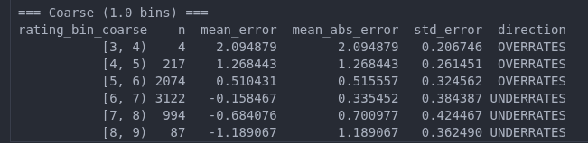

# Player Performance Predictor — Project Log

**Note 1:** As shown by the GitHub commit dates, I already suspected `performance_score` was a leakage feature. I kept the documented lines as-is until I could confirm this, and at the end I wrote down the correct numerical values without the leakage feature included.

**Note 2:** For a summary of the entire process, see the final section ("Process Summary").

---

## 1. Data Exploration

### Basic Structure
- 43,500 samples across 75 features
- Positions: Defender, Midfielder, Forward, Goalkeeper
- Data spans 998 unique players
- No null values; outliers are relatively low relative to sample size
- `player_rating` (the target) has many zero values when `minutes_played = 0`. I don't think we need this data for training — we can handle it with a simple rule: if `minutes_played = 0`, then `rating = 0`.

### Features Dropped Before the Covariance Matrix
`ID`, `name`, `team`, `nationality` (not fully certain — will check the covariance matrix), `jersey_number`, `club_name`, `match_id`, `match_date`, `stadium`, `city`, `opponent_team`, `tournament_stage`, `match_result` (possibly relevant — players on winning teams may have higher value, but unclear), `goals_team` (possibly worth keeping, since players on winning teams tend to get higher ratings).

`goals_opponent` may matter for a goalkeeper who is the primary GK for their national team.

We'll use position to determine which features affect a given player's rating.

### Feature Grouping by Position
Plan: start with a tree-based model and see whether it correctly learns to weight features by position. If it doesn't, I'll hardcode the groupings manually.

**Defense**
`crosses`, `successful_crosses`, `tackles`, `interceptions`, `clearances`, `blocks`, `aerial_duels_won`, `aerial_duels_lost`, `recoveries`, `defensive_actions`, `distance_covered_km`, `sprint_distance_km`, `top_speed_kmh`, `accelerations`, `decelerations`, `defensive_contribution`, `possession_impact`

**Attack**
`preferred_foot`, `minutes_played`, `goals`, `assists`, `shots`, `shots_on_target`, `expected_goals_xg`, `expected_assists_xa`, `key_passes`, `successful_passes`, `total_passes`, `pass_accuracy`, `dribbles_attempted`, `successful_dribbles`, `offsides` (maybe), `distance_covered_km`, `sprint_distance_km`, `top_speed_kmh`, `accelerations`, `decelerations`, `offensive_contribution`

**Goalkeeping**
`saves`, `save_percentage`, `punches`, `clean_sheet`, `goals_conceded`, `penalty_saves`

### Correlation Analysis
Plan: drop features with correlation below 0.9 to save time for tuning if things run long — though I know tree models generally aren't hurt much by correlated features.

- `minutes_played` correlates with `distance_covered_km` and `sprint_distance_km` — I'll check this programmatically rather than by hand.
- First step: drop useless columns and fix data types.
- Note: removing the zero-minutes-played rows completely changed the `minutes_played` correlation (makes sense, since those rows sat at 0.0). This introduced more variance in the data, so for now I'll keep all rows.
- `preferred_foot` should be encoded as 0/1.
- Data typing looks correct overall — no further parsing needed.

---

## 2. Data Cleaning
- Verified each feature's maximum is within a reasonable range; most columns are already float/int by default.
- Checked for rows where `assists`/`shots_attempted` exceed `goals` (which would indicate a corrupted row) — none found.
- ~25k rows have zero minutes played and therefore zero rating. Keeping them in the model would likely just produce an early decision-tree split on `minutes_played > 0`, but that adds computation for 25k rows during tuning. Since this rule always holds for the test set too, I hardcoded it instead of training on it.
- Replaced `position` with one-hot encoding so tree splits work better.

---

## 3. Model Selection

Reference: [Understanding and Handling Skewness in Machine Learning](https://medium.com/@samiraalipour/understanding-and-handling-skewness-in-machine-6e8fc8b15382)

Several features show unusually high skewness — the data is highly non-normal, so we could de-skew and try parametric/linear models.

- Tried de-skewing and testing linear models; they performed poorly.
- Found [this Kaggle discussion](https://www.kaggle.com/discussions/questions-and-answers/539888): rather than normalizing, try models that natively handle skewed data first.
- Also worth trying out of curiosity: [Regression Under Non-Normality](https://medium.com/data-science/kernelshap-vs-treeshap-e00f3b3a27db)

---

## 4. Hyperparameter Search

### Baseline (No Tuning)

**Excluding `performance_score`** (values are very low when this column is included, since it explains 92% of variance — suspected leakage, since rating may just be a direct transformation of performance):
| Model | Mean CV MSE |
|---|---|
| Random Forest | 0.3806 (± 0.0059) |
| LightGBM | 0.3791 (± 0.0061) |
| XGBoost | 0.3792 (± 0.0059) |
| CatBoost | 0.3772 (± 0.0057) |

References on search strategy: [Kaggle discussion](https://www.kaggle.com/discussions/questions-and-answers/468487), [Grid Search vs. Random Search vs. Optuna](https://dev.to/iemsaad/optimizing-machine-learning-models-comparing-grid-search-randomized-search-and-optuna-4hnf). Both suggest grid search over Optuna for small datasets, since grid search exhaustively covers the space and guarantees finding the optimum within realistic bounds.

**Including `performance_score`** (confirmed leakage — it *is* leakage):
| Model | Mean CV MSE |
|---|---|
| Random Forest | 0.1348 (± 0.0037) |
| LightGBM | 0.0732 (± 0.0005) — reading RMS value |
| XGBoost | 0.0738 (± 0.0004) |
| CatBoost | 0.0729 (± 0.0004) |

- Adding per-minute-played features improved CatBoost to 0.0728 and XGBoost to 0.0737.
- Created `script_2.ipynb` to run Optuna with the new features on CPU while grid search ran on GPU in parallel.

---

## 5. Explainable AI (XAI)

References: [YouTube playlist (videos 1 and 4)](https://youtube.com/playlist?list=PLqDyyww9y-1SwNZ-6CmvfXDAOdLS7yUQ4&si=ZTYJGvsa4tAqLy4V), [SHAP: Understanding Tree SHAP for Simple Models](https://shap.readthedocs.io/en/latest/example_notebooks/tabular_examples/tree_based_models/Understanding%20Tree%20SHAP%20for%20Simple%20Models.html)

### Interpretable vs. Explainable Models
- **Interpretable models** are easy to understand directly — e.g., a linear regression, where you can read the slope and intercept and immediately see why the model makes a given prediction.
- **Explainable models** aren't inherently readable (e.g., neural networks with hidden layers). TreeSHAP is used to explain tree-based models specifically.
- The mean of `|SHAP|` values gets skewed by outliers, just like any mean — worth checking the median or a trimmed mean before trusting it.
- There may be a class imbalance, so it's worth running XAI separately per position. This could also help define feature sets for the "one model per position" approach.
- If using interventional SHAP, the background dataset needs to genuinely represent the data distribution — it shouldn't accidentally oversample the tail or the mode.

### TreeSHAP vs. KernelSHAP
Reference: [KernelSHAP vs. TreeSHAP](https://medium.com/data-science/kernelshap-vs-treeshap-e00f3b3a27db)

TreeSHAP is much faster and applies only to tree-based models (which covers XGBoost and CatBoost here). There's a large runtime gap between the two methods despite similar accuracy.

- **KernelSHAP** treats the model as a black box and fits an approximation via weighted least squares (a Monte Carlo estimator).
- **TreeSHAP** exploits the actual tree structure directly. Interventional TreeSHAP is slower than path-dependent TreeSHAP, but still much faster than KernelSHAP.

### Interventional vs. Path-Dependent SHAP
SHAP answers the question: "If we didn't know feature X, what value would fill in for it?"

- **Path-dependent:** uses the other known features to infer the missing one. With highly correlated features, this tends to give most of the credit to whichever correlated feature happens to substitute for the missing one.
- **Interventional:** when a feature is "missing," it's replaced with values sampled from the background dataset, repeated many times, and the results are averaged. This answers: "How much does actually knowing feature X help, versus just assuming its average value?" For example, if swapping the feature across 8,000 background values barely changes the prediction, that feature doesn't matter much for the target.

Interventional SHAP uses a background dataset and cleanly isolates each feature's individual effect, even under high correlation.

**SHAP importance (with `performance_score` included):**
| Feature | Mean \|SHAP\| |
|---|---|
| `performance_score` | 0.503368 |
| `consistency_score` | 0.028934 |
| `market_value_eur` | 0.024280 |
| `pressure_resistance` | 0.020855 |
| `defensive_contribution` | 0.007955 |
| `result_w` | 0.007136 |
| `fouls_committed` | 0.005938 |
| `offensive_contribution` | 0.005415 |
| `goals_overperformance` | 0.005067 |
| `creativity_score` | 0.004717 |
| `assist_overperformance` | 0.004488 |
| `successful_passes_per90` | 0.004163 |
| `possession_impact` | 0.003777 |
| `goal_difference` | 0.002840 |
| `total_passes` | 0.002666 |

`performance_score` accounted for **74.7%** of total SHAP magnitude.

---

## 6. Four-Model Comparison
All four models landed within a narrow band (0.729–0.738), so model choice alone didn't matter much. Moved on to individually fine-tuning each model for a later ensemble.

**Per-position MSE (without `performance_score`):**
| Position | n | MSE |
|---|---|---|
| Defender | 2023 | 0.3853 |
| Midfielder | 1423 | 0.3592 |
| Forward | 1170 | 0.4021 |
| Goalkeeper | 398 | 0.3465 |

**Leakage confirmed.**

---

## 7. Feature Engineering
Earlier engineered features didn't seem to help, since `performance_score` dominated everything. Retried now that it's excluded — researched commonly important football-analytics factors and added them one at a time, checking MSE impact after each.

Residuals are still low but noticeably higher than when `performance_score` was included.

---

## 8. Ensembling

Plan: run Optuna on each model individually — 300 broad iterations, followed by 150 stricter iterations on the most promising region of the first run. At roughly the same runtime as CatBoost tuning, this comes to about 18 hours total across all three models. While tuning runs, I'll research stacking approaches. Once tuning finishes, I also want to check per-position performance for each model, to see if it's worth assigning a specific model to each position.

### CatBoost Tuning
Values converged tightly — if time were short, I wouldn't have tuned further, but with 6 days left I kept going in case of a breakthrough.

Reference: [3 Things to Know Before You Start Using CatBoost](https://medium.com/@alper.engin/3-things-to-know-before-you-start-using-catboost-185624e39806). Minimal improvement during tuning seems to be expected behavior. After ~8 hours of tuning, it did reach a new best. Worth investigating CatBoost's `sum_models` option, mentioned in the article, as a next step.

```
Final Best CatBoost MSE: 0.375386786318329
Final Best CatBoost params: {'depth': 7, 'learning_rate': 0.004047021608515087, 'l2_leaf_reg': 3.9940737878718897, 'min_data_in_leaf': 170, 'random_strength': 29.862919866938373, 'bagging_temperature': 9.11269381366412, 'border_count': 200, 'grow_policy': 'Lossguide', 'leaf_estimation_iterations': 9, 'rsm': 0.6550428091440278, 'max_leaves': 58}
```

### LightGBM Tuning
Reference: [A Deep Dive into LightGBM](https://medium.com/@sarahzouinina/a-deep-dive-into-lightgbm-how-to-choose-and-tune-parameters-7c584945842e)

```
Final Best LightGBM MSE: 0.3761290636290656
Final Best LightGBM params: {'num_leaves': 444, 'learning_rate': 0.013252177388101354, 'min_child_samples': 1, 'subsample': 0.461668213525637, 'subsample_freq': 4, 'colsample_bytree': 0.40685956209728685, 'reg_alpha': 0.018441451237763466, 'reg_lambda': 0.07832269174605633, 'max_depth': 5, 'min_split_gain': 0.9064529996740535, 'path_smooth': 8.593211194401068}
```

### XGBoost Tuning
```
best_params_xgb = {
    'max_depth': 6, 'learning_rate': 0.0034060526181177355, 'min_child_weight': 36,
    'subsample': 0.516908738492008, 'colsample_bytree': 0.5774065841179022,
    'colsample_bylevel': 0.4821345051810228, 'colsample_bynode': 0.5195935197525,
    'reg_alpha': 0.11939907553687604, 'reg_lambda': 0.032680619504481805,
    'gamma': 0.8216463872085122, 'max_delta_step': 3
}
```

---

## Process Summary

### 1. Data Exploration
- Found correlations suggesting `performance_score` was leaking target information.
- Confirmed most features were already float/int-encoded; one-hot encoded `position` and `match_result`.
- Used XAI to confirm the leakage (thanks to Mohamed's advice).
- Identified that several features are highly skewed.
- Grouped features by position, for a possible "model per position" approach.

### 2. Data Cleaning
- Removed rows with `minutes_played = 0`, since rating is always 0 in that case. The model likely wouldn't struggle with these rows, but keeping them adds 25k unnecessary rows during tuning.
- The custom data-cleaning class caused an issue: removing statistical outliers made MSE worse, since it stripped out extreme (but legitimate) goals/assists/saves values that naturally correlate with high ratings. Since tree models already handle this well, I removed the stricter outlier condition instead of tightening it.

### 3. Feature Engineering
- Added features that seemed intuitively relevant:
  1. Teams that win tend to have players who performed well overall (an assumption).
  2. Players who are "expected" to do well should have a track record justifying that expectation.
  3. Normalized stats by minutes played — 5 assists in 30 minutes isn't more impressive than 3 assists in 2 minutes.
  4. After learning how XAI evaluates feature usefulness, I had Claude generate a broader set of football-relevant engineered features, since irrelevant ones would simply be pruned out later.

### 4. XAI
1. Ranked players/features by SHAP importance.
2. The earlier run (with `performance_score` included) had ~0.7 SHAP magnitude concentrated in that one feature.
3. Cross-checked with permutation importance — despite being less reliable under correlated features, it improved MSE when used.
4. Selected important features via the intersection of SHAP and permutation importance.
5. Kept 49 features (permutation-only: 18, SHAP-only: 47, overlap: 18):
   - Full feature set (91 features): MSE = 0.3771 (± 0.0042)
   - Pruned feature set (49 features): MSE = 0.3765 (± 0.0045)
6. Best result: MSE = 0.3853, with thresholds `permutation_threshold = 0.0049628269703006645`, `shap_threshold = 0.017375141081390738`, keeping 27 features.

### 5. Model Testing
1. Tree-based models performed almost identically, with CatBoost slightly ahead after tuning.
2. Kernel-based models performed somewhat worse.
3. Linear regression was expected to underperform given the strong non-linearity in the data — confirmed.

### 6. Fine-Tuning
(See parameter blocks above for CatBoost, LightGBM, and XGBoost.)

- Discovered tuning only produced marginal (~0.00n) improvements. CatBoost in particular doesn't benefit much from tuning — but neither did LightGBM or XGBoost, which prompted further debugging.

### 7. Debugging / Investigation
1. Checked the R² of a model trained on the residuals, to see if learnable structure remained: **R² of residual model = 0.0008**. (Rationale: R² measures how much target variance a model explains. If you train on the *errors* instead of the original target and R² comes out high, that means there's still a learnable pattern the original model missed. A near-zero R² means the residual errors are essentially noise.)
2. Suspected the model might be underperforming on goalkeepers due to their smaller sample size — but goalkeepers actually had the best MSE:

| Position | n | MSE |
|---|---|---|
| Defender | 2023 | 0.3869 |
| Midfielder | 1423 | 0.3560 |
| Forward | 1170 | 0.4001 |
| Goalkeeper | 398 | 0.3473 |

   Went back and added more engineered features at this point, but it didn't help much.

### 8. Four-Model Approach
- Tried it again post-leakage-fix; MSEs were nearly identical, and the average was only ~0.000n better than a single model.

### 9. Ensembling / Stacking
1. With XGBoost, CatBoost, and LightGBM all available, tried ensembling/stacking. It underperformed, so I checked the error correlation between the three models — it came out above 99%. All three were making essentially the same mistakes, so ensembling added nothing.
2. Suspected this might be a tree-model-specific issue, so I checked residual correlation between CatBoost and kernel/linear models too — also high, despite their lower overall accuracy.

### 10. Post-Ensembling
- Settled on CatBoost alone, but ran into the model regressing toward the mean too often. Adjusting certain hyperparameters helped somewhat.


### 11. Calibration Attempts
- Applied single-seed isotonic regression to reduce the mean-reversion issue — it helped, but didn't fully resolve it (the model still over-predicts near the mean). Also tried quantile-based approaches, which underperformed expectations.
- Plan: keep exploring methods, but prioritize finishing the Stanford deep learning course over squeezing out another 0.00001 of improvement.