# MIT 6.7960
## LEC1 : Introduction to deep learning 
deep learning excels at absorbing a lot of data , while machine learning as you give more data the performance reaches a point of plateauing where it can't learn anymore while a deep learning model will learn better the more the data.
so the limitation is the data gathered.
- general rule
    -<10000 samples : Classical ML 
    -10k-100k : depending on the number of features and complexity of the data 
    -> 100 k : deep learning starts to pull ahead 

- data type 
    ML models tend to do better in Tabular/structured data even at large scale 
    DL does better at spatial/hierarchial data like images or videos that ML can't capture well 

### Why machine learning fails at spatial/hierarchial data
1. Translation Invariance
    ML fails at realizing that the 'position' or 'place of occurrence' inside the spatial space doesn't matter.
    If an object is in an image, you should learn the object's details, not its pixel-wise position.

    What traditional ML does is learn things like:
    - "An object in the left position has these features."
    - "An object in the right position has these features."

    This degrades the quality of learning because it'll likely fail or predict incorrectly when seeing the object in new positions or angles, which is always the case in computer vision. You can't train the model for every possible spatial pixel location.

    What CNN does is pass a small filter (kernel) across the entire image. During learning, it learns the features inside each local region regardless of their position. During detection, the same kernel slides across the image, detecting features (e.g., cat features) regardless of where they appear in the image.

2. Curse of dimensionality 
    ML models treat each pixel as a feature. A 240×240 image contains 57,600 pixels, or 172,800 values if it's an RGB image. Even low-quality images still have a very large number of features while not containing all the spatial information.

    ML struggles because, as mentioned above, it eventually reaches a plateau where it is no longer able to learn effectively. It would require an enormous number of training samples to learn the relationships between this huge number of features without overfitting.

    What CNN does is not treat every pixel independently because it's rare that a single pixel contains meaningful information on its own.

    Instead, it uses a kernel to look at only a small local region of the image. At each location, it computes a new feature value, producing a feature map.

    The image is then transformed into this new feature-based representation, where each value represents information extracted from a local region instead of individual pixels.

3. Hierarchial composition 
    CNN works hierarchically(each layer builds on the previous one ) using the high number of hidden layers inside.
    for example a layer will learn straight and curved lines which will create a map of edges [ears and outer body shape]
    the next layer will use this map of edges to combine them into textures and simple shapes and create the next map 
    the next map will use those textures and shapes to build an object part
    then the next map can combine all those object parts to detect the object 
    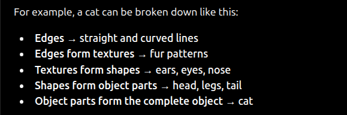

4. Large correlation structure 
    just interacted with this problem with task 3 where decreasing the n of features decreases the noise and improved MSE to a certain limit.
    while trees suffer less from such effect , it still requires alot of time training without gain
    if 6 features are highly correlated replacing them with 1 of them will still give the model the information without going through 6 rows

    CNN fixes that because it already assumes that neighboring pixels belong to the same edge/object, audio wise it'll realize that the exact neighboring samples 

### Tips for the amount of data
1. Look for projects sicilia to yours and look at their benchmarks or how much data they needed to perform well .

2. if the project is completely new you can't actually tell how much data it would require but start small , train , analyze the errors and collect data that specifically addresses those errors

3. generally if training accuracy is high but validation accuracy is low then the model needs more augmentation or data (granted that data is varied enough)

4. instead of asking how much data is needed , ask what type of data does the model need to reduce current errors .

### Using LLMs for codes 
1. it's advisable to rely on AI when you're prototyping on your own laptop PC [in a sandbox] to avoid effecting other parts or doing a system-level error like deleting a database.
2. when you're writing or maintaining a production level software , you must be more carful about security and the permissions given to the agentic AI 
3. build codes fast but be responsible, take a pause after each result to identify the problems yourself and guide the AI
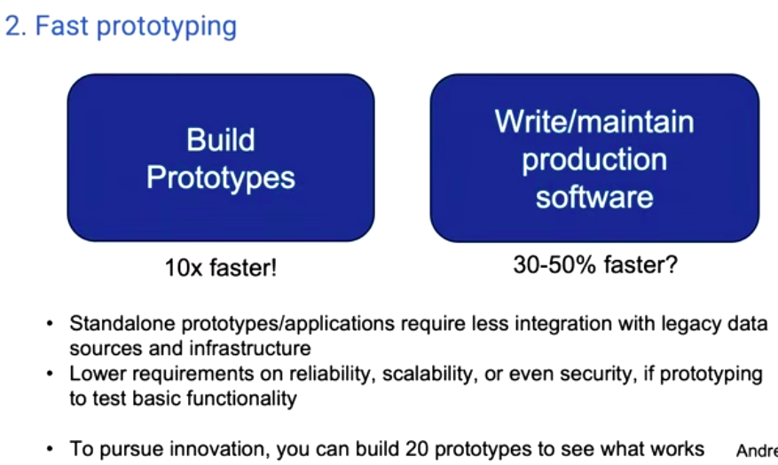

### Batch Normalization 
1. When training a neutral network you want to normalize or standardize your data.
normalization is scaling the values to a specific range [-1 , 1 ] or [0 , 1] while standardization is transforming the data into gaussian distribution which we know the formula for 
2. normalization is preferred with sigmoid or tanh activations to map image pixel values to 0->1 instead of 0->255 , it bounds the inputs so the model doesn't think that 10k~1M salary is significantly more important than 1~100 age
3. as we know standardization fixes data before PCA or regression tasks 

### Learning Process 
#### Model initialization  
##### Random initialization 
while random initialization of weights is the most common since there is no way to realize the best initialization without trying. they're still sampled carefully so that activations and gradients don't break from the start .
Xavir initialization is often used with tanh or sigmoid 
while He(Kaiming) is used with ReLU-based networks and it's variants 

##### Pretrained weights 
some concept as transferred learning , fine tunning with the weights of another similar model that's working correctly to continue training , excepted to converge faster since if it's a similar project the 'correct' setup for this project shouldn't be that far

##### Why not initialize everything to 0 
because you'll create symmetry across a full layer , if a layer is symmetric then all neurons will produce the same output and receive the same gradient.
making all the layer behaving like one neuron which breaks the idea of having this large number of neurons. initializing randomly will break this symmetry and results in different output and gradient for each until each neuron gets a meaningful weight depending on how much it contributes 

#### Forward Pass 
training data is fed into the network , every neuron computes z = Wx + b(linear function) where W is the weight matrix , x is the input matrix of the neuron and b is bias. because weights are a col vector and inputs are row vector their multiplication produces a number and b is a number so you get a number out of this step.

then applies an activation function f(z) which produces the output .[there are many activation functions to be discussed later]
the activation function is needed to break the linearity in Z , introducing this non linearity allows the network to learn complex data (a linear model can only learn linear data)
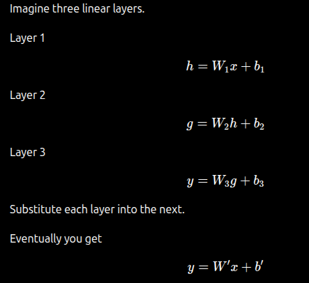
when applying a transfer function , it doesn't just amplify the data .
for example if  z < 0 output = 0 , z > 0 output = 1 thus producing a non linearity to the model [we'll explain later why this isn't really a good activation function]
if you know z = 1 you only that the input with + if it was 100000000000000 or if it was 0.000000001 that wouldn't matter. the relationship between the input / output is no longer linear allowing the model to capture complex data  

#### Loss function
error = prediction - truth

this error is then passed on to the loss function which measures how wrong the prediction is compared to the correct answer, it's a single number that represents the model's mistake(MSE , RMSE , Logloss)

"Imagine you're teaching someone to throw darts.
Suppose they throw a dart.
Without looking at the target, you simply say:
"Wrong."
Can they improve?
No." so you need a loss function to tell it how wrong it was you can tell them you missed by 3Cms left so they'll now start drawing more right

##### Why not use the error directly 
error is often not suitable for optimization. A loss function transforms the error into something that is aligned with the learning objective.

1. Positive and negative errors cancelling each other (the loss function is computed over an entire batch of predations[matrix] -explained further later)
    if the model makes two predictions one is +20 , other is -20. both will cancel each other rendering the model as perfect so you can use absolute value 

2. You may want to punish large errors more , if the model makes a very wrong mistake it should be severely corrected so squaring the error would result in that
    squaring 0.1 , 0.2 , 0.3 , 1 , 2 won't expand them as squaring 200 

3. for classification tasks you need a function to turn this probabilities into numerical losses(entropy loss)

4. for computer vision there are cls error , dfl error and box error , the loss function is a combination of a several losses

##### Cross entropy loss ~ classification problems
measures how surprised the model is by the correct answer, it punishes confident wrong answers.
it does something similar to when you manually inspect model images/labels and it would be more bad if the model detects wrong with 90% conf rather than 10%

#### Back-propagation 
back-propagation answers which weights cause this error and how should they be changed to minimize the loss
for every weight the network computes the gradient (dl / dw) how much the loss changes as the weight changes
- a positive gradient increasing that changing this weight will increase loss 
- a negative gradient increasing that changing this weight will decrease the loss 
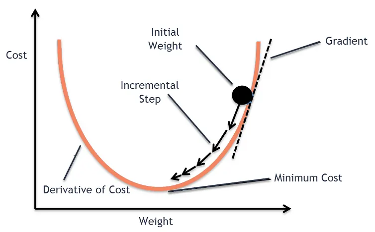
this doesn't give you the new weight but it tells you which direction is downhill , which direction decreases the loss (the slope at current point)
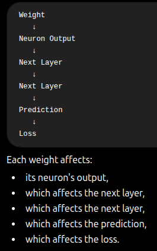
chain rule is used to get dl / dw since l isn't a direct weight function -> suppose you have layer n and n-1 
n-1 affects the weights of layers so you can have dwn / dwn-1 and dl / dwn 
using the chain rule you get dl / dwn-1 . this is used through out the whole neural network to get the update or the slope 'the downhill' for each weight 

#### Gradient Descent
Back-propagation computes the gradients then gradient descent uses them
Gradient Descent is an optimization algorithm which moves the weights in the direction that reduces loss. it repeatedly takes small steps downhill until it reaches a minimum

Wnew = Wold - a * dl/dw 
where a is the learning rate, so if dl/dw is + that means positive slope , decreasing weight will decrease loss and that's what happens here

##### Learning rate 
- if the learning rate is so small , it'll take very long time to eventually reach the bottom
- if the learning rate is too large , it's possible that the model oscillates around the minima because it's unable to take a step small enough to reach the minima(overshooting)

##### is it always possible to find the perfect solution ?
not always because we're not working on a simple 2D hill.If the network has n weights, then the loss is a function is a landscape with n dimensions i want to reach the minimal loss point of all those dimensions 
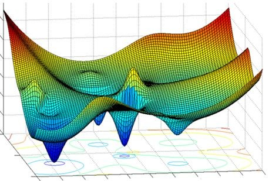
while you can get stuck at a local minima thinking it's the minimal loss , that's not the main concern
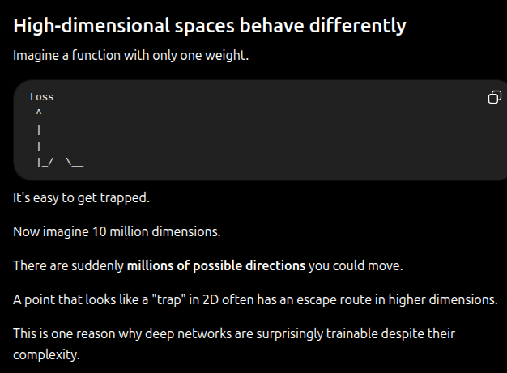

##### Saddle Points
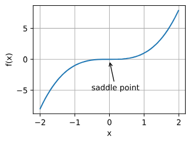
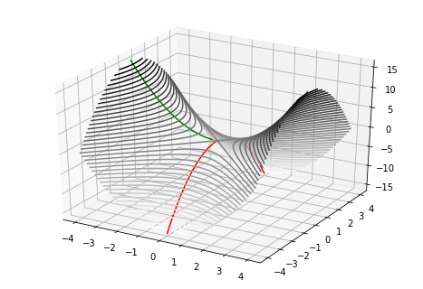

saddle points are points where the loss increases in one direction and decreases in the direction.
it's a point between negative slope and a positive slope -zero slope must separate them.
assume we're a point at slope equals 0.0000000000000000001 , the weight updating becomes a very small process.
the same problem occurs with Flat regions 

while such problems occurs frequently, and brute forcing(trying all weights) would guarantee that we reach the global minima. there are two problems 
1. you can't realistically know what are the ranges of weights you could search into
2. and even if every weight can take up only 10 values , for a small neuron network of 1000 weights that's 10^1000(i don't even what this number is) but it's not possible to do all this iterations 
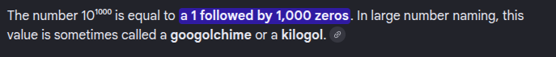

assuming we got a super computer as large as kafr elshikh , would it be worse it ?

##### Do we actually want the global minimum ?
while the global minima is the point at which loss is minimal , it's not always good it may even indicate overfitting and it may be an overkill.
if your model had 1e-5 loss and for ex 0.2 MSE , if it falls within acceptable error range for your application then it's okay, anyway recent models doesn't get stuck at local minima

Optimizers like Adam , RMSprop and momentum don't simply follow the current gradient. they also use information such as previous gradients , adaptive learning rates to reach minimal points helping them to move through flat regions
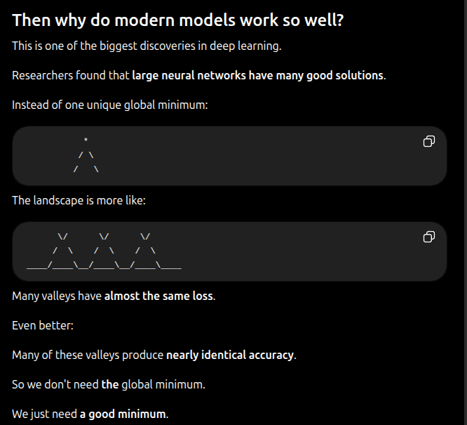

### Pointwise non-linearity
#### A network with no activation function or a linear one
assume a neural network without them 
the first layer will have outputs of (Wn , Xn , Bn are weight , input , B matrices for layer n )

output of layer 1 would be W1X1 + B1
output of layer 2 would be W2X2 + B2 = W2(W1X1 + B1) + B2 to solve it further it'll be W1W2 X1 + W2B1 + B2 so after the large n of layers
the output would still be a linear function of the input but tht'as rarely the case in real life so a function that breaks this linearity is absolutely important 
can you fit a linear model to distinguish between classifications separated by "circles"?
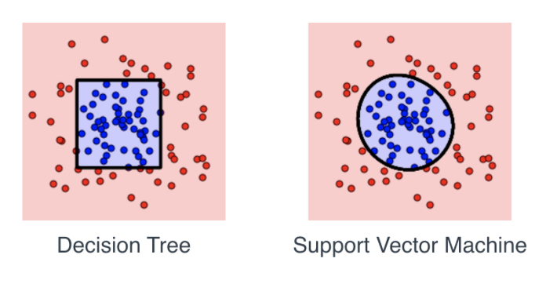

because then output of layer1 would be g(W1X1 + B1)
output of layer two would be g(g(W1X1+B1) + B2) ,even with simple non linearity breaking the function becomes complex enough to describe data 

#### Sigmoid
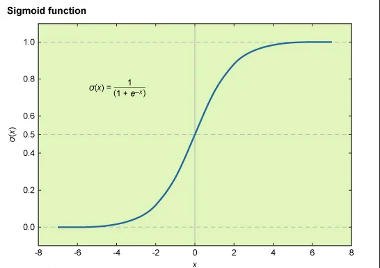
- Pros
    1. Smooth
    2. differentiable everywhere 
    3. Outputs are bounded between 0 and 1 [useful when dealing with probabilities]

- Cons 
    1. Vanishing gradient problem , as you can see from the curve at very low or very high values it flattens and the gradient is almost zero resulting in very slow learning 

    2. Saturation, large positive inputs become almost **1**, and large negative inputs become almost **0**.
    Let's assume this happens in the first layer because the inputs weren't normalized, or later during training because some weights became very large.

    A saturated sigmoid neuron no longer distinguishes between different large inputs—it outputs almost the same value regardless of the exact input, making it much less useful to the next layer.
    \[
    \sigma(10)=0.99995
    \]

    \[
    \sigma(20)=0.999999998
    \]
    Because the sigmoid's derivative is also almost **0** in these saturated regions, almost no gradient flows through the neuron during backpropagation. As a result, its weights receive tiny updates, so the neuron learns very slowly (the **vanishing gradient problem**).
    the weights can be fixed with time due to the other neurons correcting the weights so it's not a permanent problem. 

    3. Outputs are not zero-centered but rather always positive
    for every layer , z is computed and z is always positive so after the input layer the input for all layers is guaranteed to be +.
    dl/ dwi = dl/dz * dz / dwi 
    since dz / dwi = xi which is always positive in this case then the sign depends only on dl/dz (= dl / da * da / dz)
    remember Wnew = Wold - learning_rate * dl / dw
    if dl/dw of all weights are the same sign then all weights either decrease together or increase together , which shouldn't be the case because some weights should be increased while others decreased to reach the minima

#### tanh
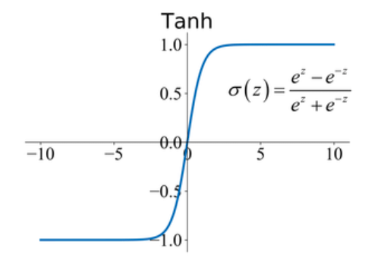
Pros    
    1. Centered around 0 making optimization faster
Cons
    1. still saturates around edges
    2. still runs into vanishing gradients 

#### ReLU
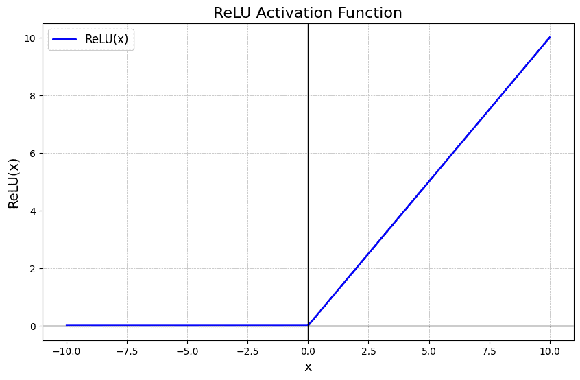
Pros 
    1.there is always derivative on the positive side so gradients don't shrink resulting in faster training

Cons 
    1. Dead neurons for negative weights since the input doesn't even mean anything if weight is negative because it gets collapsed (or a neuron doesn't matter if all it's weights are negative)

#### Leaky Relu
https://medium.com/aaweg-i-nterview/can-you-tell-us-the-advantages-of-using-leaky-relu-over-relu-280cb27eda9e
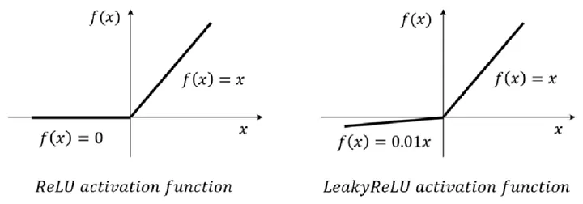
doesn't kill neurons when weights are negative 

Pros 
    1. Solves dying neurons problem 
    2. Prevents saturation at both positive and negative resulting in faster learning
    3. Reduced sensitivity to initialization 

#### Softmax
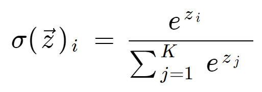
different from the above ones because it's not used in the hidden layers , but used as final output layer
it converts scores to class probabilities with their sum equal 1
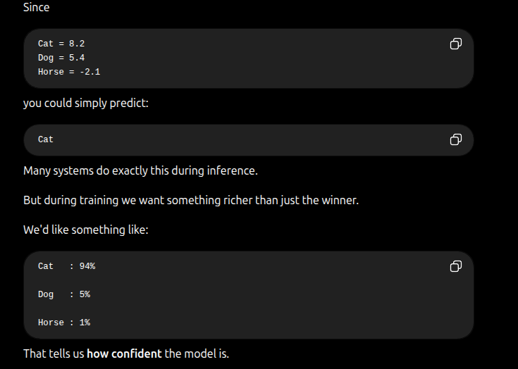

### Representational Power  
while one layer gives you access to represent a linear decision surface(with a ramp like threshold)
a 2 layer networks can with nonlinearity introduced between them can make you in theory approximate any function. two lines intersections can create a triangle , with this triangle pointy top moving right or left with different, and a different slope for each side it matters quite a lot  (that kinda reminds me of PCA)
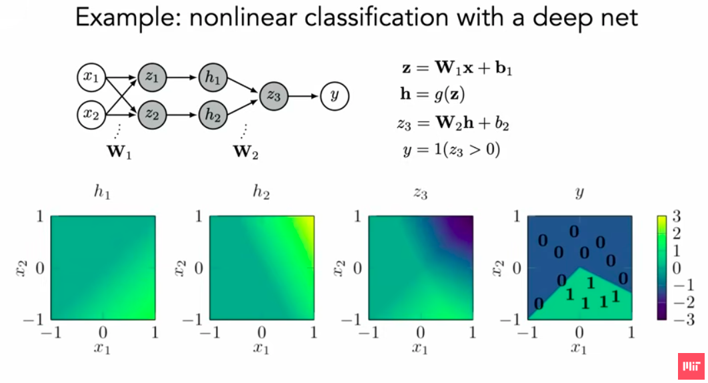
but of course the more the layers the more the approximation accuracy .

### Deep Models generalizing 
#### Classical picture
as the capacity (n of parameters) increases the model becomes more prune t over-fitting and if they're low the model becomes prune to under-fitting

some example of the n of params
    1. polynomial regression if you try to capture the data using a 1D poly it fails. capturing it with 40 Poly will improve it but using 90D poly, it'll most certainly over-fit and build an equation that solves or gets close to every sample.but is awfully wrong with data it never seen.
    imagine training a model on 1-10 range and it builds a 90 degree poly 
    feeding it 11 will have a very large error 

    2. for tree-models n of params can be n of trees and thresholds for each tree.

## LEC2 : How to Train a Neural Net

### Deepnets
despite having so many weights/biases tunable parameters the model doesn't over-fit
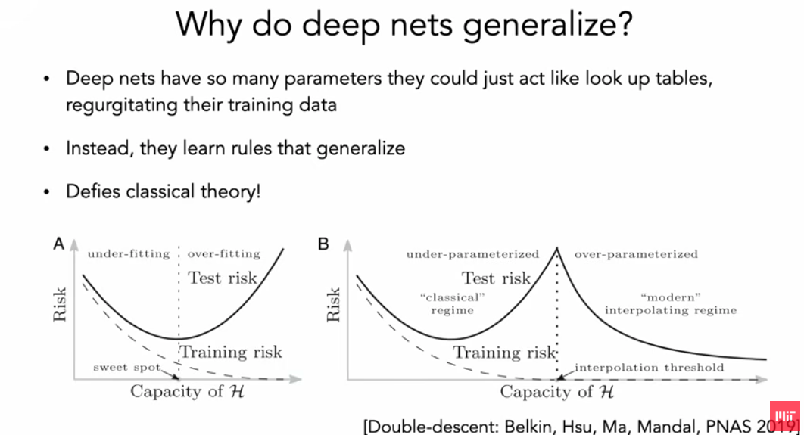
deep learning models behave exactly like classical models when they're under-parameterized then you're enter the over-parameterized region where increasing the n of params actually increases the model accuracy .
this was proved experimentally 

### Mini-Batch Gradient Descent 
you always want to minimize the overall loss function J which is the sum of losses for each sample.

in a full Gradient Descent , you run the model on all N samples , you compute avg loss , update the gradient , update the weights once
that worked before when datasets were not as huge as millions of images , trillions of texts  .

then came Mini-Batch gradient descent, scientists found that the gradient of a sample of the data is often a noisy yet good approximation of the actual gradient . so if you split the data into batches and update the weights after every patch you'll converge to correct values faster.

if the batch size is 1 , updating every sample it becomes Stochastic Gradient Descent that's rarely used 

Pros :
    1. Much faster updates because if you need 10000 updates for the weights to converge correctly , rather than needing N * 10000 images processed.(that scales significantly with the excepted large N )
    you'll only need 64k images processed only

    2. escapes local minima and saddle points,those noisy updates can give enough push to climb out of shallow local minima or escape saddle points , because even it it's currently experiencing a flat loss surface, it's very unlikely for the random batch selected to have 0 gradient exactly because it's noisy
    this is called 'implicit regularizer'

Cons :
    1. Training can be unstable , because for example if you're training a general object detection model - let's say it should detect 128 objects in total.
    taking a batch size of 64 random images won't cover all images , so if the model does bad on 30 objects and weights needs to be updated for them but they're not included in the batch the model won't know .

    and even if you take 256 images it's not guaranteed that the 128 objects are included in this randomized batch . you make take measures to do that but you'll need as unbiased of data as possible to avoid such problems 

    2. one bad sample can push the weights in the wrong direction significantly 

### Momentum 
Momentum is biasing the weights to move in the same direction - like a ball moving down a hill , if you push it - it gains momentum and is biased to move down easily.

why is that done ? we mentioned before that MBGS is noisy so it's moving more like that 
↙
↘
↓
↙
↘
↓
by applying momentum the weights updating takes the previous gradient into consideration rather then training each update individually 

Previous movement
↓
Current gradient
↙
Combine both
↓

the more momentum the more previous movement/gradients are taken into consideration
momentum is usually below 1 such that previous gradients vanish , don't dominate the entire process

- new weights become Wt+1 = Wt + Bvt-1 - learning rate * current gradiant because Bvt-1 includes Bvt-2 and B^^2vt-3 , the older speeds vanish gradually ? so they don't dominate the process.

momentum is a hyper-parameter because it can help or hurt 

Pros 
    1. Faster convergence as it decreases noise and moves directly in correct gradient (less zig zagging)
    ↓                                                           ↓
    ↓                           becomes                         ↓↓
    ↓                                                           ↓↓↓

    2. less sensitive to batches with much noise 
    if all gradients are moving in similar directions , the noisy gradient won't make much effect because it's loop is affected by others and other gradients are are affected by the domination of correct gradients

    3. Helps traverse flat regions , there was a problem earlier where the gradient becomes zero. in this case even if the gradient is zero the weights still gets updated in the direction they were previously moving towards.

    4. Computationally inexpensive 

Cons 
    1. overshooting the minimum , like a ball rolling through a hill if it gains enough momentum it'll oscillate around a minima or even overshoots and cross the whole hill rather then settling at the bottom .

    2. Takes time to change directions , with high momentum it becomes harder to move in an updated direction, it's kept under 1 so it'll eventually happens but it'll make time which may slow down the process

    3. requires re-tunning of learning rate since they amplify each other
    
### Evolution Strategies  
uses ideas that are inspired by biological evolution 
a set of blackbox methods that optimize systems by learning parameters instead of using back propagation, it creates slightly different versions of the network to see which ones perform best

#### Innovation 
due to back-propagation having some requirements such as
    1. differentiable model for reasonable learning time  
    2. high storage capability because you need to store activations for back-propagating 

#### Methodology 
    1. start with parameter vector θ ("the parent")
    2. create multiple candidates (W + N1 , W + N2 ,....) by adding random noise to weights 
    3. evaluate the fitness of each candidate 
    4. create a weighted blend of the candidates where each candidate contributes to updating the weights 
    5. repeats
it's mathematically similar to approximating the gradient because you're actually observing the changes in loss as weight changes slightly dl/dw then you pick (or give the highest weight) to the one that minimizes the loss

Pros 
    1. Highly parallelizeable , each worker evaluates one perturbation independently 
    2. Works with non-differentiable objectives since it doesn't differentiate . 
    3. simplicity 
    4. can optimize almost anything not just neural systems
Cons 
    1. doesn't scale well with huge models as randomly perturbing billions of weights gives a very noisy estimate of which direction is best. while back-propagating actually makes calculations to find this direction 

    2. less smooth training curve , because one lucky random update can improve significantly then the next ones can be useless

    3. Mutation n must be picked carefully because low n of mutations whill make the exploration process slower and large n will the search almost random (imagine very large n of mutations some of those will almost cancel out and if you're left with very different 'directions' your weight will be something that isn't aligned with any(you can see it's like the zigzagging instead or straight lines scenario with momentum))

    4. sample inefficient as the complexity increases(large neural network or large n of mutations) , it becomes more computationally expensive to evaluate each candidate rather instead of calculating the gradients

### Clipping gradients
we discussed before that with high momentum or high learning rate the model can oscillate around the minima or even overshoot it completely and that's why gradients clipping exists to prevent gradients exploding.
clipping by value isn't the most efficient because you lose the relation between weights updates.
for example if the model wanted to double a weight while halving the other to have an X4 multiplication factor between them.
if you clip the first weight then you lose this relation.

#### Clipping by norm
instead of clipping each gradient individually , you look at the whole gradient vector and limit it by it's magnitude. if it exceeds the clipped value you divide all the vector components accordingly. such that you keep the relation between the weights , the problem here is a very large gradient will result in clipping it and all others which may result in slower learning 

in both cases the threshold for clipping must be picked carefully because if it's small you lose some of the important large steps if you're far from the optimal
and if it's large then it's not really clipping ._.

- clipping doesn't solve the problems it treats them temporarily , if the gradients keep exploding then learning rates / momentum and initializations must be checked 

### What is Important in a Loss Function 
Continuos , differentiable , smooth
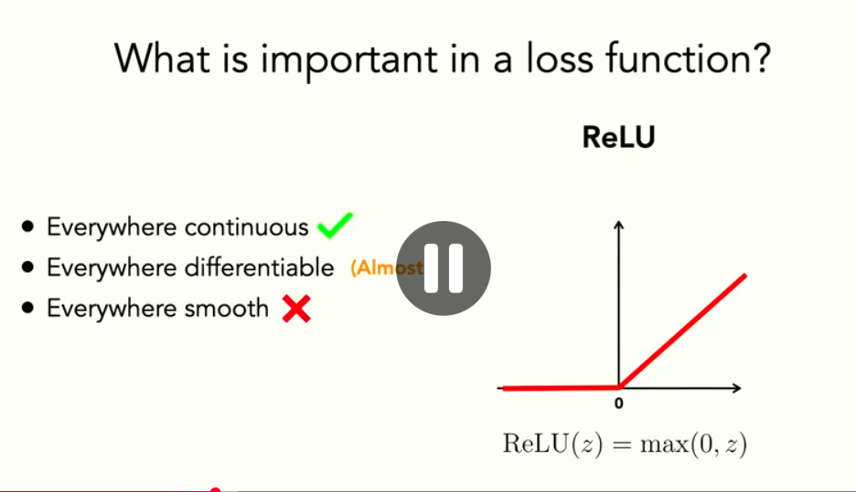
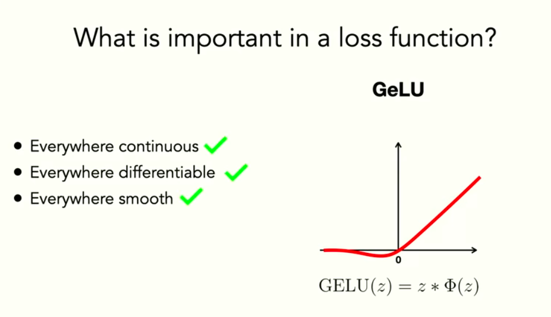

# Pytorch 
