# Stanford EE368/CS232
## Introduction
### Image
image is a visual representation in a form of a function f(x,y) where f is related to the brightness or color at point (x,y).
an image is continuos in amplitude and space

### Digital Image 
since continuos signals can't be used in computers , images were discretized using pixels. with the same methodology as normal sampling, using too many pixels will result in over-sampling -capturing unnecessary details- , using too few pixels will result in under-sampling omitting important data 

each pixel is represented by (x,y) where x,y are the corresponding row and col indices. - (0,0) is top left

### Color Components 
since each color consists of a combination of Red,Green and Blue .
cameras can be set in the same to construct 3 RGB channels with each having it's individual brightness/value .
when the 3 channels are combined you create the image with it's details again
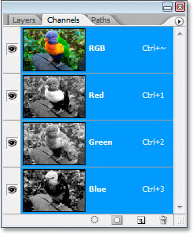 [RGB]
or
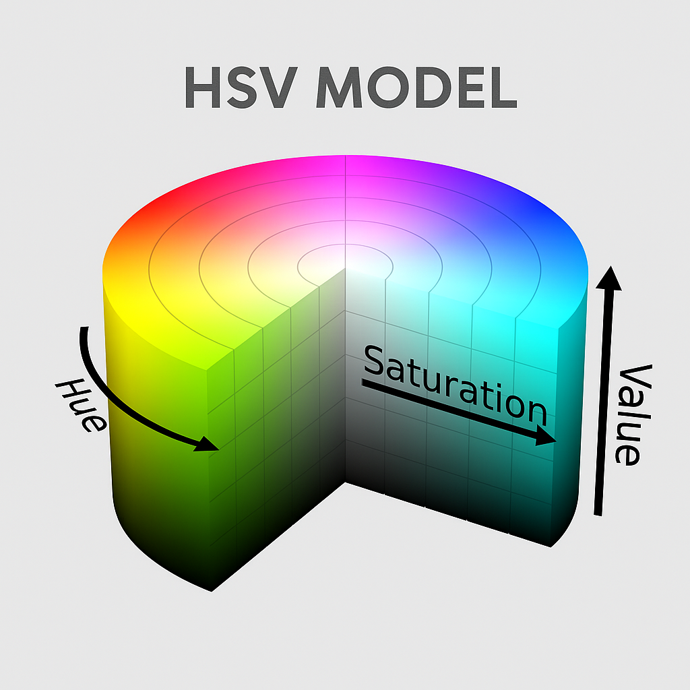[HSV]
where (H)ue is the color itself . measured from 0 to 360(continuos)

(S)aturation is how intense/pure this color is 
(V)alue is how bright or dark the color is

## Point Operations 
### Quantization 
after sampling you break the image into pixels but each pixel still holds a continuos value.
quantization is taking the infinitely continuos values for a pixel and mapping it to a limited number of discrete levels .
**Continuous image** —*Sampling*→ **Discrete pixels** —*Quantization*→ **Discrete pixel values**
a 8bit image will have pixel values ranging between 0 and 255 .
the higher the n of bits , the better the description of the continuos value but the higher the size .
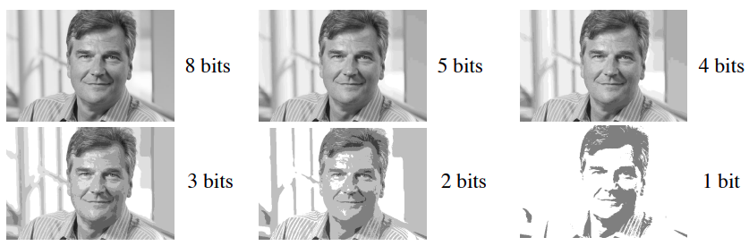

._. okay the course got weird with over mathematics , let's check extra resources.

# Signal Processing Session Extra Knowledge 
## Quantization Error
the error introduces when we convert the continuos amplitude signal into a digital signal with a limited number of amplitude levels.
for ex if you've ac continuos signal that ranges from 0 to 9K
if you describe it using 100 amplitude levels(i know it should be 2^^n but just for example) where each level is 0.09k.
to describe the 0.12k frequency the closest option would be the first level with 0.09k with an error of 0.03k

as you increase the n of bits representing the signal you could describe numbers accurately and this quantization error decreases 

- Standard FFT assumes stationary , and fails for a non-stationary signal so STFT is used instead 

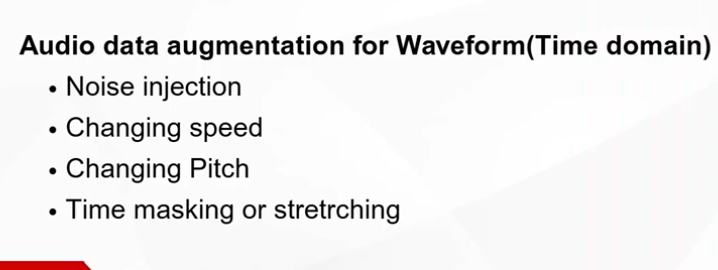

# 3Blue1Brown FT
## Important plots
1. The normal Amplitude-Time Graph which describes the original signal
2. The Wrap up in 2D dimension which is just another representation that describes the signal without giving time much importance since it's periodic signal
it's set such that the distance from the origin equals the amplitude at this point. and points are mapped to their angle using the wrapping up frequency.

the wrapping frequency is the amount of cycles per second . if it's 1 cycle/sec then you'll represent each second with a cycle around the origin 
4 cycles/second then each second will be represented by 4 cycles.

when both frequencies are equal , the center of mass of the wrapper graph shifts to the right .

- The Almost Fourier Transform ·=
3. x-coordinate for center of mass - frequency , -to be tested later-.
with all frequencies the center of mass tends to be slightly shifted yet close to the origin .
until you reach an integer constant of the fundamental frequency , the center of mass starts shifting to the right . since all values now fall on the right side

## The Almost Fourier Transform 
so with each pure sinusoidal you get a mass_coordinates-frequency curve which has a spike at the fundamental frequency and a shape for the wrapper that's "clean"

when you combine two functions of frequencies A , B the same behavior of two spikes at the fundamental frequencies A and B will show again which helps you determine the components of the new function 
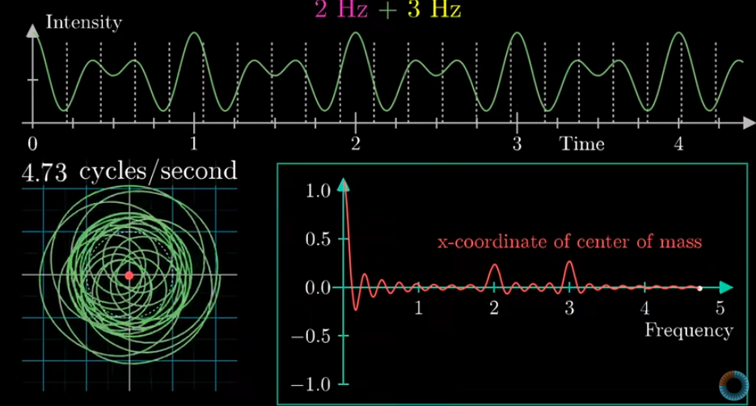

i guess that makes sense because adding them is a linear operation and wrapping them is also a linear mapping so it's a linear operation where super position should apply.

since we're dealing with waves , they can be described by euler hence we can treat the Y axis of the wrapper as an imaginary axis .
 , since we know every e power exponential is a circle multiplied by the value of g(t) that gives us the expected wrapper shape

to find the center of mass, we average the whole points by integrating over the fundamental period and dividing by it 
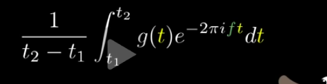

## The Actual Fourier transform 
same idea but instead just not dividing by the time , so it's just a scaled version of the previous almost fourier transform .
so you can say you're multiplying each frequency component with (t2 - t1).
therefore a signal that exists for more time , receives a higher value but will this effect ruin the "pulse" that happens only at fundamental frequency . it won't since they still cancel out (they cancelled out , their multiplied version will also cancel out)

and the center of mass exists is shifted only to the left 'pulse' only with the fundamental frequencies .

# Audio Signal Processing for Machine learning Extra Knowledge 
[https://www.youtube.com/watch?v=iCwMQJnKk2c&list=PL-wATfeyAMNqIee7cH3q1bh4QJFAaeNv0&index=1]

## Sound and Waveforms
- a higher frequency results in a higher sound صوت أرفع 
- a larger amplitude means a louder sound      صوت أعلي
- knowing amp,frequency and phase is enough to describe a single sinusoidal wave and we know that any complex signal can be described by a superposition of weighted harmonics .

### Pitch
- describes how high or low a sound feels/perceived 

- the ear doesn't perceive voices sounds linearly , suppose you've 100 - 200 - 300 - 400 Hz
each of those is +100 of the previous one , but the ear won't think "oh it's increasing the pitch with equal intervals each time" what it'll do is

100 -> 200 the pitch doubled 
200 -> 300 the pitch was x1.5
300 -> 400 the pitch was x1.25

so it's related to the ratio between the current frequency and the previous one rather than the actual interval change -> hence logarithmically .

- voice that differ by a power of 2 are perceived similarly like 220,440,880.
physically that's becaus it's the same construction but with double the cycles "like a squeezed version"
also this whole concept makes the idea of fundamental period/frequency makes sense more .

### Midi Notes
a way of representing sounds using numbers rather than their frequency
A4 for example corresponds to 440 , A5 would correspond to 880 , A6 would be 1760 . each differing by an octave(x2 ratio)
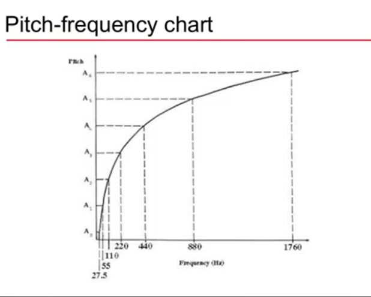

### Cents
each octave is divided by 1200 cent , 100 cents in a semitone 
the noticeable pitch difference is 10-25 cent difference

## Intensity , Loudness and Timbre
### Sound Power
the rate at which energy is transferred by a sound source at all directions 
### Sound Intensity
Sound power per unit area W/m^^2 (so they're like the rules for light)

Threshold of Hearing  TOH is 10^^-12 W/m^^2
Threshold of Pain     TOP is 10 W/m^^2 
due to this very long range , intensity levels is measured in DB and is expressed in a logarithmic scale

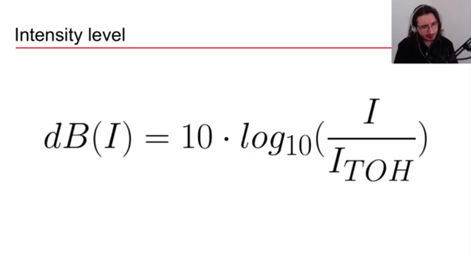

### Loudness 
how strong a sound feels to your ear .
depends on frequency / duration / age . a shorter sound will feed less loud even if both are of the same intensity .

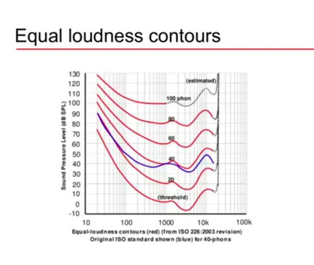 -> what this graph tells is that to perceive sounds with same intensity . the actual intensity can be more or less with correlation to the frequency .and that with proved experimentally .

### Timbre 
"Color of the sound" , if you've two sounds with same intensity , frequency , duration . 
a guitar playing A4 at the same loudness is different than a piano playing A4 .
due to the harmonics in the sound 

#### Sound Envelope
describes the amplitude/loudness of a sound over time. - like a loudness gradient 
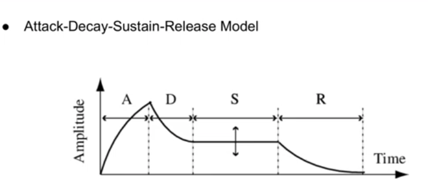
A - Attack how quickly the sound goes from silence to it's maximum level. is it a slow growing sound or an impulse like sound

D - Decay how quickly it falls from maximum to a lower level

S - Sustain the level where the sound stays while it's source remains (holding the note)

R - the quickly the sound fades as you kill the source

those 4 differences introduce harmonics to the actual sound which makes it different for different sources even if they agree on Intensity , frequency and loudness
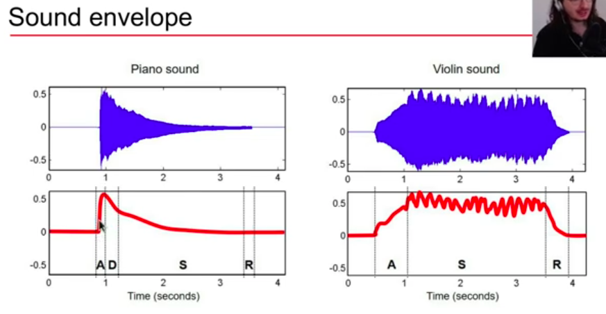

### Complex Sound
A sound is a superposition of sinusoids. each sinusoid is called a partial.
the lowest partial is the fundamental frequency 
a hormonic partial is a frequency that's a multiple of the fundamental frequency 
Inharmonicity is the deviation of a partial's actual frequency from the frequency it would have if it were an exact harmonic of the fundamental.

## Digitalization 
similar to everything that's analog in nature , where you need to digitalize it for processing .
we already know sampling and quantization 

Dynamic Range is the difference between the largest and the smallest signal a system can record , so it's like the bandwidth 
as the dynamic range increases , the higher n of bits per sample the higher the accurate / resolution 

## Types of Audio Features
Different features capture different aspects of sound which can be used to build intelligent audio systems .

### Audio Feature Categorization  
1. Level of abstraction 
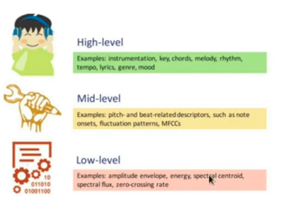
- low-level are features that make sense for the machine but not as much readable for a human 

2. Temporal Scope
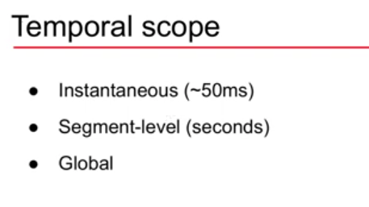
- instantaneous is 20 to 100 ms
- Global ,you analyze the entire sound recording to calculate one overall value

3. Signal Domain
Time Domain Features and Frequency Domain Features [covered later]
as mentioned in a session a spectrogram is obtained by SFT and it consists information about time , frequency and each frequency magnitude 

4. Machine Learning 
Extract the features we want from the time domain and frequency domain to use them as the input features for the model. 

5. Deep Learning 
Pass whole audios and the DL model will decide the features by itself using neural networks .

Raw audio or Spectrograms
    ↓
Neural Network
    ↓
Learned acoustic features
    ↓
Speech representation
    ↓
"hello, how are you?"

## How to Extract Audio Features
-- don't know if this useful since deeplearning does it automatically but it's only 20 min so..

### Time Domain Feature Pipeline
After sampling . Framing is done 
framing is grouping multiple samples into 1 frame 
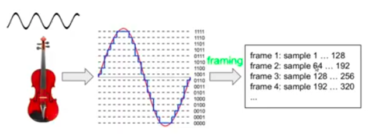
framing is done before extracting features because 1 sample @ 44.1KHz is 0.0227ms which won't handle any meaningful information . - it's like taking 1 pixel .
so it's kinda like the kernel in image processing ?

Frames contain power of 2 num of samples , like in training having a power of 2 batches is more suitable for how all the computational processes are done which makes it faster.

we then compute the features then aggregate the results (using statistical means like mean , median , GMM) . aggregating so that we get a set of values that describe the whole sound .(reducing or summarizing the frame-level information)

aggregation doesn't have to result in "one number", ex

#### Examples of Aggregation 
1. Frame:     1     2     3     4     5
RMS:     0.10  0.20  0.30  0.20  0.10

[0.10, 0.20, 0.30, 0.20, 0.10]
                  ↓ mean
                [0.18]
2. You can go further:
[mean,std,min,max]
So 100 frame values might become just 4 summary values.

3. 
Frames:
[F1][F2][F3][F4][F5][F6][F7][F8]

Instead of combining all 8 into one number, you could combine them in groups:
[F1][F2] → average → A1
[F3][F4] → average → A2
[F5][F6] → average → A3
[F7][F8] → average → A4

8 frame values
      ↓
4 aggregated values
You have reduced the temporal resolution, but you haven't destroyed all temporal information.
and you still have information about time .

### Frequency Domain Feature 

# ICA
a technique that separates a set of mixed signals into their original / independent source signals .

for example if you're at a party with two people talking in the same time with two microphones where each is faced to one of persons. 
M1 will capture 70% of 3bas voice and 30% of Yousef Voice
M2 will capture 30% of 3bas voice and 70% of Yousef Voice 

using ICA you can recover 100% of Yousef's voice and 100% of 3bas voice using the signals of the two microphones -didn't dive into the math yet but i guess that's because both are sinusoidal waves and you can easily separate them but voice isn't a perfect wave , maybe the signature of voice things - will know soon ._.- 

ICA operates under two key assumptions:
    The source signals are statistically independent of each other.
    The source signals have non-Gaussian distributions. 

## Mathematical Model
x = As
where s are the original signals (Abbas and youssef original sounds) -unknown as the microphones don't hear the sources separately 
but each microphone hears 
x1 = as1 + bs2
x2 = cs1 + ds2

a linear combination of both which allows us to represent them using matrices 
A is called the mixing matrix which holds the coefficients/weights
and x is the sounds observed by the microphones 

- The problem is that we only have x . we don't know A os s
so ICA estimates an unmixing matrix 
Wx = s
the W matrix is found such that the signals (s) produced are as independent as possible since they come from two different sources.

independency is defined such that knowing s2 doesn't give you any extra information on s1 and vice versa
p(s1 | s2) = p(s1)
p(s2 | s1) = p(s2)

or p(s1,s2) = p(s1)p(s2)
where p represents the probability density 

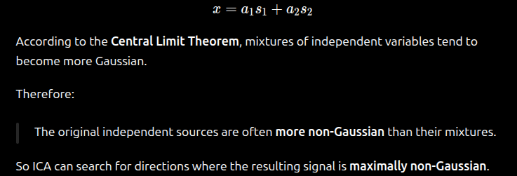
"Which transformation of my observations gives me signals that look the least Gaussian?"

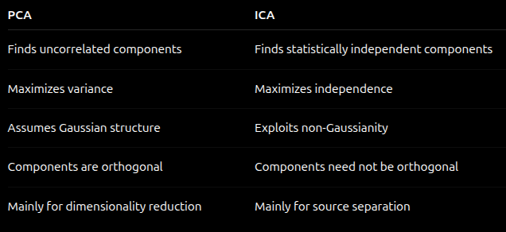