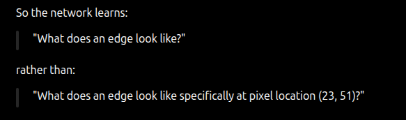
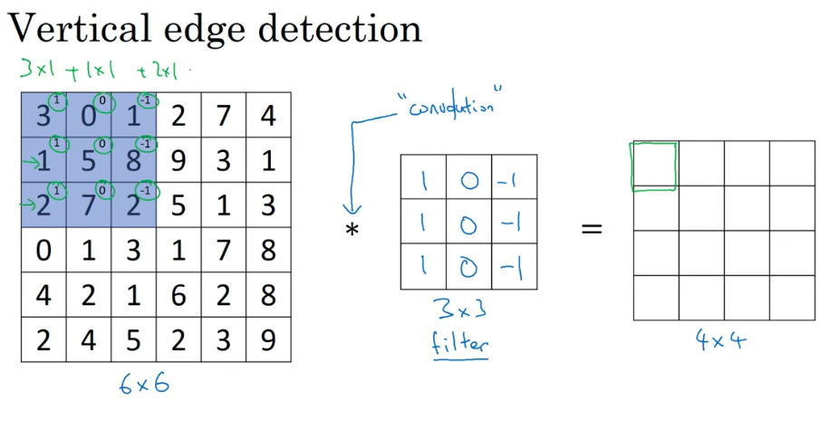
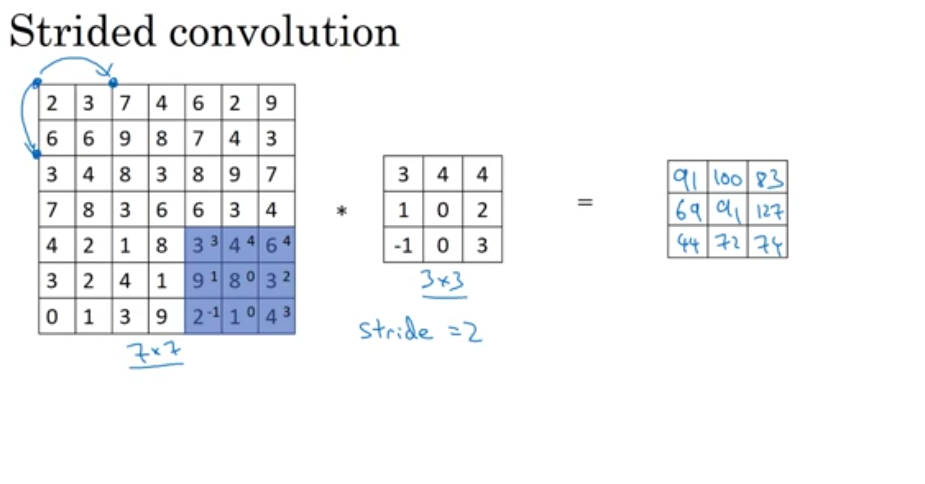
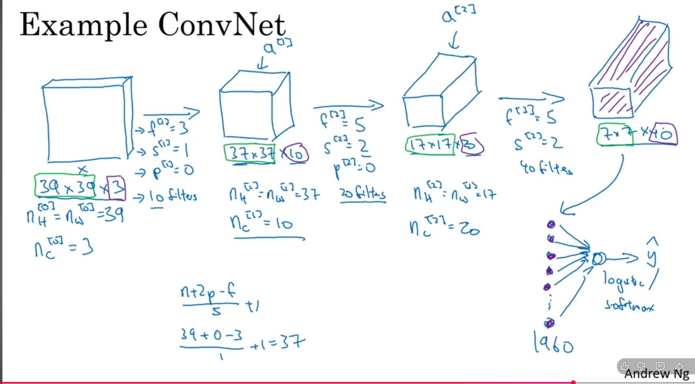
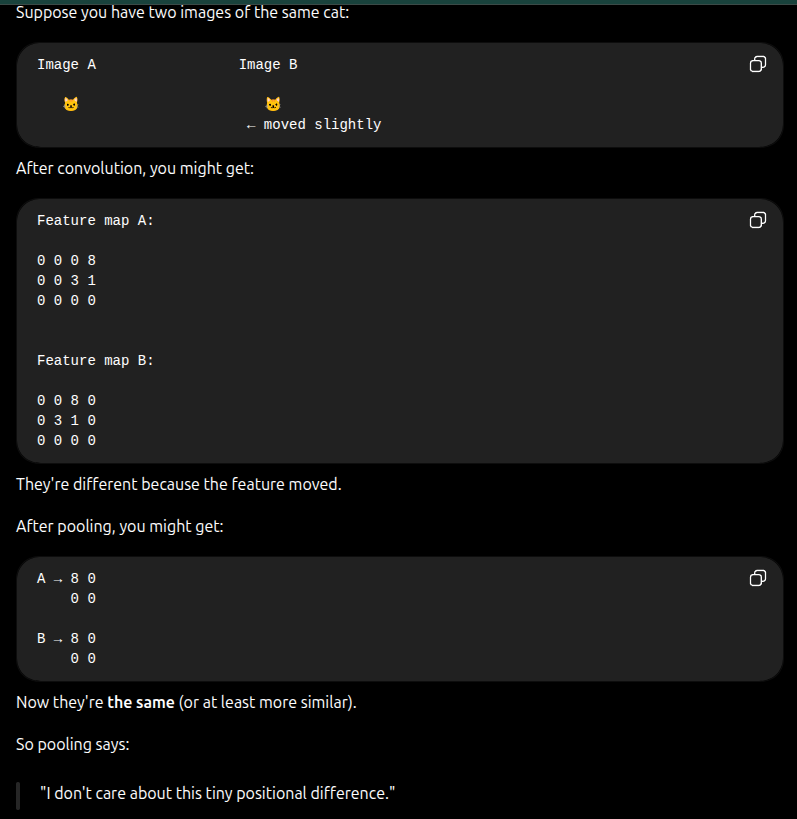
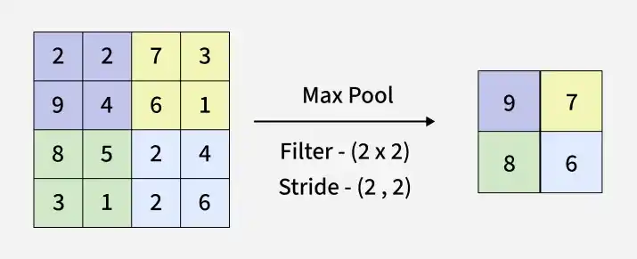
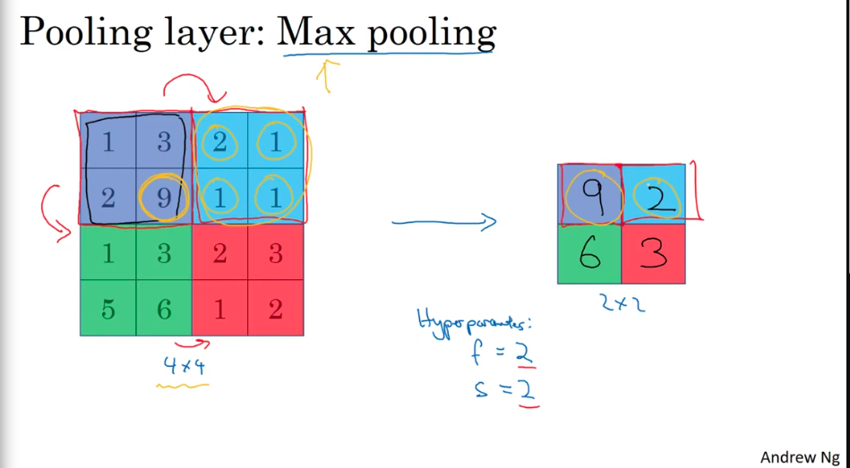
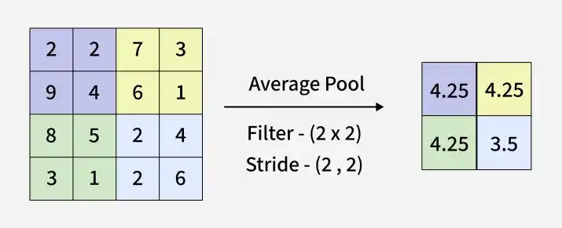

# Andrew CNN course
## L01
### The Point of CNN
- with large images / high quality images with large number of pixels . you can end up with 1000x1000x3 Pixels/Neurons in the first layer 
if you've 50 layers . that ends up very computationally expensive .

- also a fully connected network won't directly care that pixel (n,n) is next to pixel (n,n+1) - maybe the weights will adjust themselves to show such correlation but it's not guaranteed .

-a simple fully connected neural network (MLP) can learn spatial invariance, but it does not get it naturally the way a CNN does (built in) rather than having to feed multiple "pixel positions" to make the neural network realize it itself 

- CNN will look at small window (kernel) at a time 

- We've also talked about the hierarchically before (pixels ,edges , textures , parts , objects)

## L02 - 03 ~ Edge detection example
### Kernels overview
while a vertical edge kernel has a specific shape , same as horizontal or diagonal
- 

- with an actual CNN,Kernels are randomized - initialized and are updated each epoch to minimize the loss just like the weights in a normal neural network
    multiple kernels pass through the entire image each providing extra information - like a kernel for vertical edges , horizontal edges and diagonal edges 
    each kernel producing a feature map .
    all those feature maps are then stacked together as different channels 

- assume we've 1000x1000 image with 32 kernels .
    this will produce 32 1000x1000 feature maps as 1000x1000x32 
    those 32 feature maps are then passed as the input to the next later.

- and what's why it's hierarchial . in the first layer you had a normal image .
    the kernels provided you with edges . you then fed those edges to the next layer 
    the next layer kernels will use those edges to construct shapes , like circular , rectangular , oval and such 
    the next layer can use this combination of shapes to create actual objects 

- hmm that seems so specific but it's worth knowing that a kernel by default holds spatial relative information . like from bright to dark or dark to bright .
if we don't care about such information we take the absolute value

- actually i think that would have been useful in robocon competition to determine right or left sides of the rack but the environment should be taken into consideration . 

## L04 ~ Padding [https://www.geeksforgeeks.org/machine-learning/cnn-introduction-to-padding/]
since the output after the convolution is equal to the area of image / area of the kernel .
the output size is always lower than the input size.

padding is a technique used to keep the preserve the spatial dimensions of the input image after convolution producing a feature map with the same size as the input .

- it adds extra pixels around the border of the input map before convolution 
hmm so let's assume we've a 6x6 image (area = 36) and a 3x3 kernel (area =9). the output will be a 4x4 map .
if we somehow make the image 18x18 then we get a 6x6 feature map (that's just an example)

- Improves model performance but slightly increases computation cost because if you keep dividing each input by 9 each layer . the layers in the end will have no spatial information to learn

- it also increases contribution of border pixels because normally they will always contribute less than pixels in the center as the kernel only sees them once per "row scrolling"

### Types of Padding
1. Valid padding , no padding 
- applies convolution without adding any extra pixels , output feature map becomes smaller than input
- border information is lost during processing 
- useful for dimensionality reduction 

2. Same Padding 
ensure the feature map has the same spatial dimensions as the input map by adding zeros around the boarders .

## Lec 05 ~ Strided Convolution  [https://medium.com/@juanc.olamendy/unlocking-the-power-of-strided-convolutions-in-neural-networks-7de108589f43]

unlike conventional convolution which moves the filter one pixel at a time (stride of 1) , strided convolution moves multiple pixels at once which results in a smaller feature map . [so it's like a form of downsampling]

- it allows you to ignore small details relative to your application , - allows you to see the bigger picture 
for example if you're detecting shapes you're mostly interested in the outer part and not every detail in the inner structure 

- Boosts computational efficiency , kernel "sweeps" the input faster 

- used in image classification to retrain only essential information 

- not the topic but used also in automatic speech recognition 

## Lec 6 ~ Convolution over Volumes
seems straightforward 
- kernel and filters usually have the same depth (same n of channels) , but you still can have a filter that looks only at one layer of the RGB images 

## Lec 7 ~ One layer 
same as normal neural networks , you still add bias and apply linearity for each feature map .
Z = X∗K + b​
A=f(Z)

where K are the kernels , X is the input feature maps
f is the non linearity function (often RELU) and A is the resulting feature maps 
so the first layer deals with images while the hidden layers deal with features and how strong/weak or absent they're 

so our parameters are weights and biases . assume n x n x c kernel and k layers .
the n of total parameters will be ((n . n . c) +1) K . independent of the actual image pixels which solves the problem with deep learning where dealing with high resolution images resulted in having  n parameters in the billions 

## Lec 8 ~ Simple Convolutional Network  
Kinda straightforward too.

## Lect 9 ~ Pooling Layers [https://www.geeksforgeeks.org/deep-learning/introduction-to-pooling-layer-cnn/]
A pooling layer is used to reduce the spatial dimensions (width and height) of feature maps while keeping the most important information.
splits the feature map into multiple regions then takes the avg or max of the region .
specially useful if the whole feature "split" is full of zeros so you can break it down into a single zero . 

If the region contains:
[7 3
2 1 ]
does our project / scenario requires much detail about where this feature was located exactly ? or can it tolerate this approximation .

an object moving slowly , slightly will produce the same exact map if we use pooling since same features will often fall in the same group . making it less sensitive to small translations 

"Pooling reduces how much the network needs to care about small spatial differences between images."
so it increases generalization and as we know reducing the n of parameters will reduce the risk of over-fitting 

- reduces dimensions , leading to faster computation and fewer parameters
- Focuses on important features and supports hierarchial learning 

### Types of Pooling Layers
1. Max Pooling 
- Commonly used due to strong performance in practice

2. Average Pooling 
- Produces smoother feature maps compared to max pooling

3. Global Pooling 
Global pooling reduces each channel of a feature map to a single value , that seems aggressive._.

it can be maximum global pooling or avg 

- pooling is done independently on each channel 

- pooling layers will have filter size and stride as hyperparameters
#### Limitations 
1- Causes information loss due to omitting some details , depends on the use case and the accuracy / level of details needed 

2- may lead to over-smoothing of important features . if a you've a 4x4 space with a 9 and all 1s , using average pooling that's squeezed to "3" and you lose a strong feature [max pooling doesn't suffer from this maybe it's why it's good in practice]

