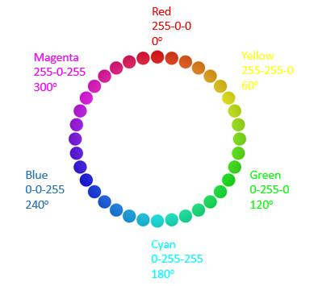
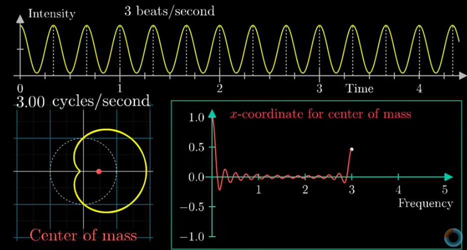
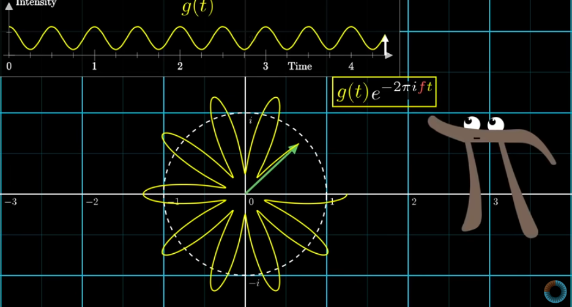

# Stanford EE368/CS232
## Introduction
### Image
image is a visual representation in a form of a function f(x,y) where f is related to the brightness or color at point (x,y).
an image is continuos in amplitude and space

### Digital Image 
since continuos signals can't be used in computers , images were discretized using pixels. with the same methodology as normal sampling, using too many pixels will result in over-sampling -capturing unnecessary details- , using too few pixels will result in under-sampling omitting important data 

each pixel is represented by (x,y) where x,y are the corresponding row and col indices. - (0,0) is top left

### Color Components 
since each color consists of a combination of Red,Green and Blue .
cameras can be set in the same to construct 3 RGB channels with each having it's individual brightness/value .
when the 3 channels are combined you create the image with it's details again
 [RGB]
or
[HSV]
where (H)ue is the color itself . measured from 0 to 360(continuos)

(S)aturation is how intense/pure this color is 
(V)alue is how bright or dark the color is

## Point Operations 
### Quantization 
after sampling you break the image into pixels but each pixel still holds a continuos value.
quantization is taking the infinitely continuos values for a pixel and mapping it to a limited number of discrete levels .
**Continuous image** —*Sampling*→ **Discrete pixels** —*Quantization*→ **Discrete pixel values**
a 8bit image will have pixel values ranging between 0 and 255 .
the higher the n of bits , the better the description of the continuos value but the higher the size .

._. okay the course got weird with over mathematics , let's check extra resources.

# Signal Processing Session Extra Knowledge 
## Quantization Error
the error introduces when we convert the continuos amplitude signal into a digital signal with a limited number of amplitude levels.
for ex if you've ac continuos signal that ranges from 0 to 9K
if you describe it using 100 amplitude levels(i know it should be 2^^n but just for example) where each level is 0.09k.
to describe the 0.12k frequency the closest option would be the first level with 0.09k with an error of 0.03k

as you increase the n of bits representing the signal you could describe numbers accurately and this quantization error decreases 

- Standard FFT assumes stationary , and fails for a non-stationary signal so STFT is used instead 

# 3Blue1Brown FT
## Important plots
1. The normal Amplitude-Time Graph which describes the original signal
2. The Wrap up in 2D dimension which is just another representation that describes the signal without giving time much importance since it's periodic signal
it's set such that the distance from the origin equals the amplitude at this point. and points are mapped to their angle using the wrapping up frequency.

the wrapping frequency is the amount of cycles per second . if it's 1 cycle/sec then you'll represent each second with a cycle around the origin 
4 cycles/second then each second will be represented by 4 cycles.

when both frequencies are equal , the center of mass of the wrapper graph shifts to the right .

- The Almost Fourier Transform ·=
3. x-coordinate for center of mass - frequency , -to be tested later-.
with all frequencies the center of mass tends to be slightly shifted yet close to the origin .
until you reach an integer constant of the fundamental frequency , the center of mass starts shifting to the right . since all values now fall on the right side

## The Almost Fourier Transform 
so with each pure sinusoidal you get a mass_coordinates-frequency curve which has a spike at the fundamental frequency and a shape for the wrapper that's "clean"

when you combine two functions of frequencies A , B the same behavior of two spikes at the fundamental frequencies A and B will show again which helps you determine the components of the new function 

i guess that makes sense because adding them is a linear operation and wrapping them is also a linear mapping so it's a linear operation where super position should apply.

since we're dealing with waves , they can be described by euler hence we can treat the Y axis of the wrapper as an imaginary axis .
 , since we know every e power exponential is a circle multiplied by the value of g(t) that gives us the expected wrapper shape

to find the center of mass, we average the whole points by integrating over the fundamental period and dividing by it 

## The Actual Fourier transform 
same idea but instead just not dividing by the time , so it's just a scaled version of the previous almost fourier transform .
so you can say you're multiplying each frequency component with (t2 - t1).
therefore a signal that exists for more time , receives a higher value but will this effect ruin the "pulse" that happens only at fundamental frequency . it won't since they still cancel out (they cancelled out , their multiplied version will also cancel out)

and the center of mass exists is shifted only to the left 'pulse' only with the fundamental frequencies .
