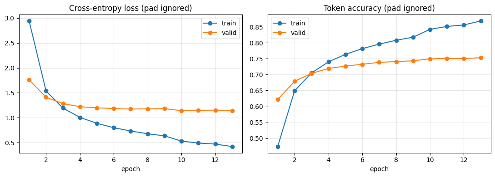

- okay so we studied already frequency based models like concurrence matrix are problematic due to the large input and that they're mostly zeros 
will use Glove to turn the words into embeddings first(will also give a try to FastText later)
[i explained multiple embeddings methods and frequency based methods in the notes folder].

text cleaning is done already , to make everything a lowercase so they're not treated differently (have done a similar thing with lang-chain)

- will use BertScore since it was mentioned it's the most common and it uses embeddings , METEOR also is another option i consider 

- running with default params 

validation loss stays almost constant after the 6th epoch while train loss keep decreasing so the model is showing signs of over-fitting but let's try if we improve generalization that both train loss and validation loss decreases together 

- using normal frequency based evaluations and default parameters, it's accuracy is 75% 
with Bert score P: 0.8885  R: 0.8789  F1: 0.8834

will try with batch size of 32 , it'll slow down but i'll reverse it if it over-fits since i know larger batch size noise' is useful to increase for generalization .
i'll also try to increase learning rate  slightly (1.2e-3 then i'll try 1.5 or 2e-3) and see if that'll make it not pleatue at the 6th epoch - stuck on a local minima  
it improved to  BERTScore   P: 0.8905  R: 0.8830  F1: 0.8865

- will try swapping the optimizer with AdamW instead of Adam since it generalizes better  . still the same problem T-T
- increased dropout a bit to increase generalization and it improved accuracy a little bit 
BERTScore   P: 0.8942  R: 0.8854  F1: 0.8895