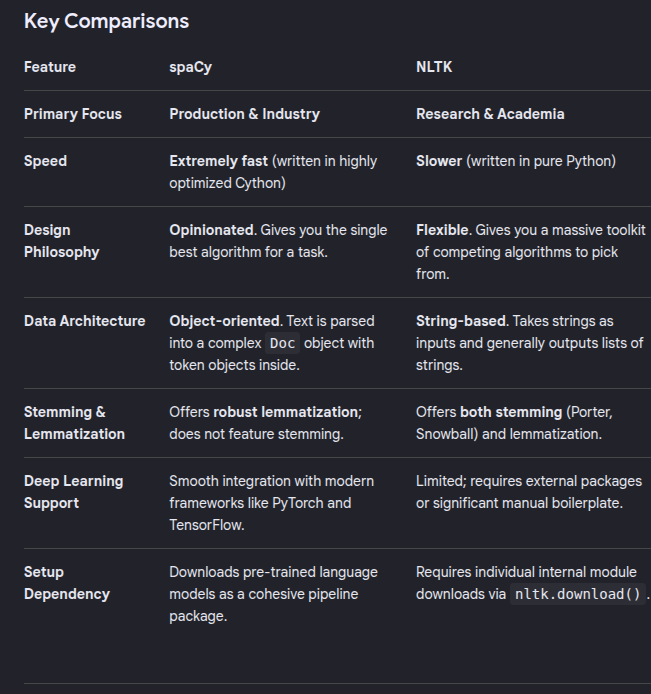
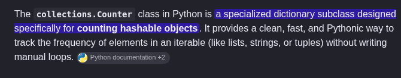

# Phase 1
## Initial Thoughts

i'll start working through it step by step - that's easier since i need to search about the syntax for multiple parts .
it if wasn't already broken into points i would have probably used AI to help me break it into mini parts before moving forward.

first with loading the images i'll use file globbing to load them into one list while keeping the image name 
then i'll rename the captions.txt to captions.csv since it's already csv formatted to use pandas with it 

- checked by lengths that every image has 5 captions correctly . will still continue "drop" images

- created a dictionary of dictionaries 
{
    "image_name" :
    {
        "image" :
        "captions" : []
    } 
}
that'll be used for training 

## Preprocessing 
### images
already removing images without captions , so i'll only check for empty images to remove them 
i'll normalize / resize in later steps when i decide which model to choose 

### Text 
i'll make a class for it , it should lowercase , strip punctuation  and leading / trailing whitespaces , duplicate captions
guess we can also remove captions that are small like equal to or less than 2 words since they're most likely incomplete
wonder if we can also use some sort of thing that detects if a sentence is complete or not to be more reliable so i'll search for that

okay i'll move the preprocessing step to before creating the dictionary , think that's smarter 

## Data Leakage 
okay i had the wrong thought initially about dividing some by image and some by caption but it turned out that that's a classical mistake .
and i should split by image ID not by caption since the model will get high accuracy if it already knows the content of the image and only tweaks at a bit or doesn't at all

# Phase 2
## Model selection 
leaning towards InceptionV3 since it provides larger size and i've suffered from small size images before . if i figured it needs a lot of time  i'll use ResNet since it's easier to use 

## Images features
- resized images to be 299x299 for inceptionV3
- applied the tensor transformation
- extracted features from the image and cached them to use later without having to run all this cycle above again

# Phase 3 
- will use NLTK library, since i lowercased and removed punctuation and <2 word letters i think i can tokenize by spaces initially then look more into the requirements 

- i found that a threshold is used for this frequency or occurrence based tables but i don't think i'll use one here . data is already kinda small to have to do such thing 
i realize that it explodes and that it'll mostly be zeros but with 8k , i'll handle extra time for highest accuracy
._. okay turned out that it actually can damage the model accuracy which makes sense because if a model sees a word once it can't really learn about it except once so the original not-learnt embeddings remain close to what they were initially .
i'll add a threshold of 2 

- building the table is done only on the train dataset , since if you get frequencies of words in the test set that's data leakage

- padding is done to make all sequences matching the longest one , to be apply to join them intro matrices and for more efficient parallel processing , it gives the same effect as normal padding in CNNs with the same cons 
will padd to the 95% percentile of words

# Phase 4 ~ Design
i'll use LSTM since it's the one searched about 
after discussing with the claude man wwe narrowed it down to three designs 
Approach 1: Image as first input token ("inject")
Approach 2: Image as initial hidden state ("init-inject")
Approach 3: Merge with word embedding at every timestep

the first approach is the simplest but both 1st and 2nd the image is fed into in the start . and the RNN should stay remembering what the actual image  is during both training and testing to train efficiently (it doesn't have to suffer having to remember what the actual image after like 50 word).
so i'll use the 3rd approach at which the image is projected at which the image is concatenated to the embedding at every time-stamp to be always remembered by the model
it'll result in more parameters but again i care more about accuracy 

# Phase 5 ~ Model Training
- will use AdamW as the optimizer since it gave better results in and since it provides better generalization 
- i think i'll try with batch size = 64 then increase it to 128 if i needed more generalization or reduce it if the model generalized well to improve accuracy
- found something called ReudceLRonPlateau that adjusts the learning rate according to the val loss i'll try it here and if i've time i'll try it on the other task since that was the problem

okay it's the same problem kinda 

train loss decreases while val loss plateau

will start by adding attention 

# Phase 6 ~ Model evaluation 
- [https://www.youtube.com/watch?v=7f540fyEw9w]
i'll use Beam search for decoding as it achieves higher fluency since it doesn't just pick the word with the highest probability . it tracks a fixed k of most promising sentences at each step . you can say it looks up "the whole way" rather than looking at first step only

in path planning it's A* while greedy is dijkstra

i'll do it with BErtscore for the same reasoning mentioned in Task6.1 

okay so accuracy is pretty good , done in 9.30 seconds, 435.29 sentences/sec
BERTScore — Precision: 0.9338, Recall: 0.9289, F1: 0.9285

i'll try improving it further using attention 