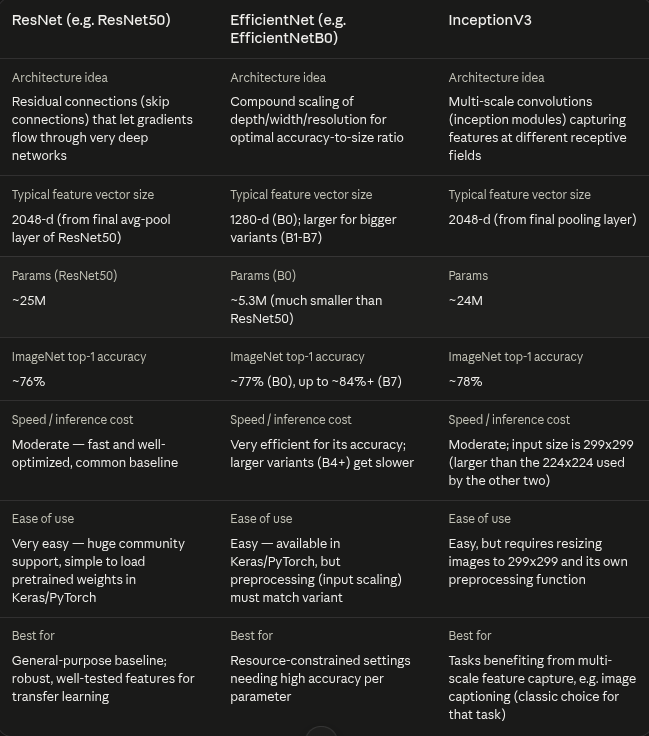

# Phase 1
## Initial Thoughts

i'll start working through it step by step - that's easier since i need to search about the syntax for multiple parts .
it if wasn't already broken into points i would have probably used AI to help me break it into mini parts before moving forward.

first with loading the images i'll use file globbing to load them into one list while keeping the image name 
then i'll rename the captions.txt to captions.csv since it's already csv formatted to use pandas with it 

- checked by lengths that every image has 5 captions correctly . will still continue "drop" images

- created a dictionary of dictionaries 
{
    "image_name" :
    {
        "image" :
        "captions" : []
    } 
}
that'll be used for training 

## Preprocessing 
### images
already removing images without captions , so i'll only check for empty images to remove them 
i'll normalize / resize in later steps when i decide which model to choose 

### Text 
i'll make a class for it , it should lowercase , strip punctuation  and leading / trailing whitespaces , duplicate captions
guess we can also remove captions that are small like equal to or less than 2 words since they're most likely incomplete
wonder if we can also use some sort of thing that detects if a sentence is complete or not to be more reliable so i'll search for that

okay i'll move the preprocessing step to before creating the dictionary , think that's smarter 

## Data Leakage 
okay i had the wrong thought initially about dividing some by image and some by caption but it turned out that that's a classical mistake .
and i should split by image ID not by caption since the model will get high accuracy if it already knows the content of the image and only tweaks at a bit or doesn't at all

# Phase 2
## Model selection 
leaning towards InceptionV3 since it provides larger size and i've suffered from small size images before . if i figured it needs a lot of time  i'll use ResNet since it's easier to use 
