# MIA Slides [Taking headers and searching further]
## Embeddings 
- since a neural network works with numbers not texts. we need to convert each word/number into vectors . but in some encodings every word can be  unrelated mathematically .

- An embedding maps each word/token to a relatively small, dense vector.
while embeddings are not set manually and the neural network learns these numbers during training.
- i remember that i saw in 1blue3brown video that embeddings of words that are related end up being "pointing" to the same direction in some dimensions .

- while training the gradient descent adjusts those vectors until similar things ends up pointing in some direction which leads to more accurate results .
for example barking and dog should end up pointing to the same direction in some directions.
so the model will correctly complete the next sentence 
the dog is ... loudly (for example - i know it's not exactly like that)

- embeddings can also represent high-dimensional complex data like images or audios - not just text

- each embedding is a vector of 128 dimension and well a 128 dimension is not a human-interpretable thing but it's understood by the RNN

    Words
    ↓
    Token IDs
    ↓
    Embedding
    ↓
    Dense vectors
    ↓
    RNN / LSTM
    ↓
    Hidden representation
    ↓
    Output

### Types of Embeddings 
1. Word Embeddings
represents each word with a dense vector -discussed above

    1. Word2Vec : learns word vectors based on their context, words appearing in similar contexts tend to get similar embeddings ~ feel like that's useful if you're building something related to a specific domain/topic

    2. GloVe : instead of primarily looking at individual prediction tasks like Word2Vec, GloVe uses global word co-occurrence statistics.
    like cat frequently occurs with pet , milk
    king frequently occurs with male , kingdom 

    3. FastText : represents words using subwords like breaking them instead of dealing with the complete word. useful for rare words that are combination of other words
    feels like this will be very useful with german since most words are combination of multiple shorter words.

2. Contextual Embeddings
    Traditional ones like the above ones give one vector per word regardless of the context. the vector ends up agreeing with "words that come into all those contexts" in some dimension but not fully agrees

    Contextual embedding provides multiple vectors per word and according to the context , the model treats the word with the corresponding embedding .

    ELMo , BERT and GPT-style models

3. Sentence Embeddings
    instead of embedding one word , an entire piece of text is embedded .
    useful for semantic search [Semantic search is a data lookup method that understands the meaning and intent behind user words. It looks past exact word matches. It uses context, synonyms, and concepts to find relevant information]
    i remember using something similar in an the previous year training with players information/specs embeddings.

4. Image Embeddings 
    representing an image directly as a compact vector instead of millions of pixel values.
    similar images end up having similar embeddings. useful for things with image similarity .

5. Graph embedding
    numbers that represent nodes in the graph, capturing nodes information and how they're connected / related .
    
### Approaches to Word Embeddings
#### Frequency-Based Approaches 
- embeddings that concern themselves with how often this word appears especially around the other words that gave it context .

1. Co-occurrence Matrix is the matrix that contains all words in text and how the number of co-occurrences in the given data

    - they use co-occurrence to build the vectors for each word -> the words cat and milk seems to occur with each other much so their embeddings should be related.

    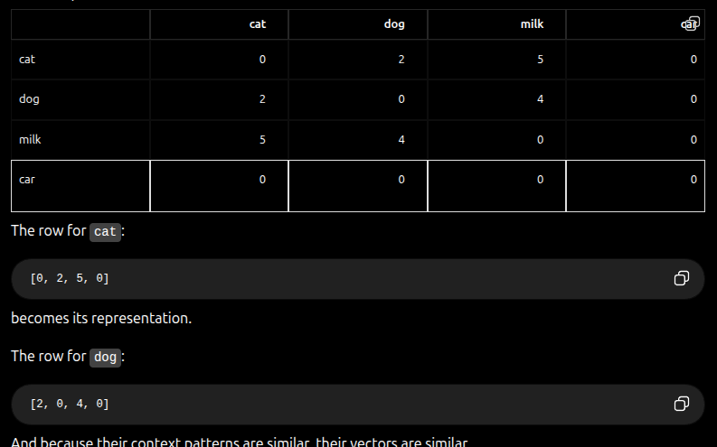.
    - as you can see in the image the dot product (measurement of how aligned) of cat and dog gives 20 while milk and dog are 10 . cat and milk are 10
    car with anything is 0
    so in the given data cats and dogs are related "both are animals" then milk is what they drink.[just an example on small data]

    - one of the problems with the co-occurrence matrix is that it explodes as the number of words increase in the data and most of the elements will be zeros since a word may appear with like -being generous- a 2000 other word and the rest will be zeros .

2. TF-IDF Term-Frequency 
    - Measures how often does a word appear in a document 

    - Inverse document frequency measures how rare a word appears across entire collection of documents . if a word like "the" appears in every document then it's not a special word. it have low IDF weight . while a word like electro-spinning which appears rarely is more informative of the context 

3. One Hot Encoding 
    - gives each category a number , encountered something similar in Task3 with the position of the goalkeepers but it was better to break the 4 of them into multiple columns rather than numbers. 
    since 4 isn't a "higher" number it's just a different position so the model shouldn't learn "magnitude" - guess it would have been okay if it's a tree model - but still a tree model wouldn't mind the splitting of cols 

    - Dimensionality , for something like nationality in the 3rd task. it's not realistic to add ~100 Cols because machine learning classical models end up over-fitting or generating a correct structure with large number of features .

    - Vectors sparse , with the nationalities situation again. all the rows will be 0 except the correct nationality .

    - No Semantic meaning , all words are equally distant in the vector space , similar words are not close together . for example a defender is closer to the goal keeper more than the attacker [kinda i don't know football ._.]

4. Bag of Words
    - Represents a document by which words it contains and how many times each word appears, while ignoring word order. "i love cats" is the same as "cats love i"

    - 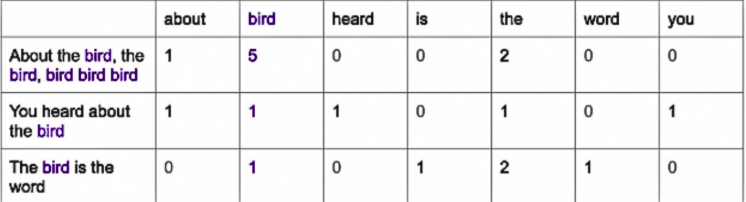

    - so it knows which words appear but not who chased whom which can make words less logical

    - still suffers from high dimensionality since vector_size = vocabulary_size which can be very large and is mostly a zero vector same problem 'a word won't be next to most other words'

### Similarity Measures 
1. Euclidean distance 
    - The distance between two vectors , if one vector is larger than the other it results in a large distance even if they're directed in the same distance.

2. Cosine Similarity 
    - Rather than relying on distance to avoid suffering from the euclidean distance problem . it measures the angle between both the vectors . the smaller the angle the more they're "pointing to the same direction" the more similar they're .
    useful with embeddings since we've been saying for ages that things similar

    it's a normalized dot product since dot product measures alignment also 

### Sparse vs Dense Vectors
1. Sparse vectors  
    vectors that results from discussed methods like Frequency-Based approaches which are mostly zeros and due to that are large in size

2. Dense Vectors [actual embeddings]
    are vectors of low dimension which contains mainly of information are learned by back-propagation 

### Evaluation Metrics 
1. Intrinsic Evaluation 
    1. Word similarity 
    2. Word Analogy
        as mentioned above , that similar or related words end up pointing in the same direction
        male and female may "Agree" on same dimension as both genders but will be opposite in another dimension as opposite types of genders 

        king − man + woman ≈ queen. things like that tend to also happen between embeddings where you can move from 'king' to 'queen' using logical operations .
        stripping gender of male then adding gender of female to the title king 

        Tokyo and Japan will be related , Paris and France

    3. Extrinsic Evaluation 
        Test the accuracy of multiple embeddings to choose the one with higher accuracy
    
    4. Language Generation Metrics 
        I. Perplexity
            Measures how surprised/confidence a model is .
            When evaluating the model . if the model gives the "correct" words high probability then it's perplexity is lower and the model isn't surprised that it made the correct/wrong assumption [i feel like it's log loss where mistakes with big probability are punished more]

        II. BLEU 
            Commonly used for evaluating generated text against one or more reference text.
            BLEU checks how many n-grams overlap between the generated sentence and the reference 

            support the reference is "The cat is sitting on the couch" and the model generates "the cat is sitting on the bed" because both are fairly identical so BLEU looks at n-grams matching words of the sentence .

            BLEU considers an overlap of 1,2,3,4 grams to judge the sentence along with a brevity penalty [a penalty that applies for incomplete sentences by penalizing candidates that are shorter than the reference]
            "the cat" alone shouldn't have a 2-overlap with the words above because it's not any close to them . it's incomplete

            Unigram BlEU -> checks single words and ignore order . onl checks if the word exists in the reference 

            Bigrama and higher BLEU  -> checks pairs or groups of consecutive words. takes exact order into consideration 

            The company announced a new product yesterday
            Yesterday, the company announced its new product

            those two sentences will have 1 at 3-BLEU and 0 with higher BELU and will only have 3 matches at bigram BLEU even though both sentences are the same
            
            

        III.ROUGE
            ROUGE measures how much of the reference text is covered by the generated text, common for text summarization 

            ROUGE compares consecutive n-grams, just like BLEU. ROUGE-L is different because it uses the longest common subsequence rather than exact consecutive n-grams to avoid the problem with BLEU misjudging sentences that give the same meaning but different order

            ROUGE-1 will break into single words and check how many of this words exist in the reference

            ROUGE-2 , -3 are also similar to BELU 

            ROUGE-L uses the longest common subsequence, how much is the sequence respected and the words exist in the reference

            same example 

            The company announced a new product yesterday
            Yesterday, the company announced its new product
            
            a 5-gram sequence [the , company , announced , new , product] appears in both (correct sequence , doesn't matter the words in the middle)
            which shows the strong relation between both giving strong indication that they're basically the same sentence .

        IV. METEOR
            compares the generated text with a reference but it doesn't constrain itself to only exact word matches . it looks for the semantic relation between words that don't match completely .

            the cat plays 
            the kitten plays 

            BELU and ROUGE will miss that cat and kitten are highly related .
            METEOR uses Exact matches , Stem matches and Synonym matches.

            METEOR penalizes wrong wrong ordering similar to BLEU but it applies a penalty rather than considering it fully wrong like BELU

            Worthy a note that METEOR uses electronic directions like WordNet instead of embeddings .

        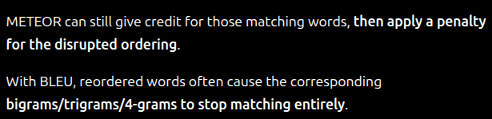

        V.  BERTScore 
            similar to METEOR but uses contextual embeddings to compare the semantic similarity between generated and reference text
                
                "The automobile is fast."
                "The car is very quick."

                will have a high similarity score since 
                automobile ≈ car
                fast ≈ quick

        VI. Human evaluation but that's ._.

    5. General Metrics 
        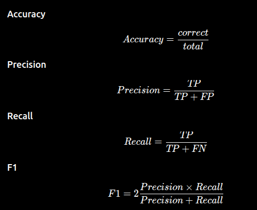

## Limitations of a neural network 
1. No Memory 
    Processes each data point independently , doesn't recognize that the order of the points matters 
    i couldn't complete the task because the task is .... : if the model looks at the whole sentence it'll be easy to suggest hard,difficult but if it only looked at the task is .... it'll be actually random

2. Needs Fixed-Size input
    when designing the input layer of neural network . it's already hard coded you can't increase or decrease them at run time because you introduce untrained weights.

    we could truncate it to make have every input at the fixed length but this will come with the loss of information 

3. Doesn't realize order 
    the sentences "the cat chased the dog" and "the dog chased the cat" are completely different in meaning yet containing the same words . so if you tokenize by word and looks at one at a time both will result in the same processes in the neural network .

    no , the food was good 
    the food was no good 

## RNNs (Recurrent neural network) [https://www.geeksforgeeks.org/machine-learning/introduction-to-recurrent-neural-network/]
- The fundamental problem that RNNs try to solve is 
How can a neural network process data where the order matters?
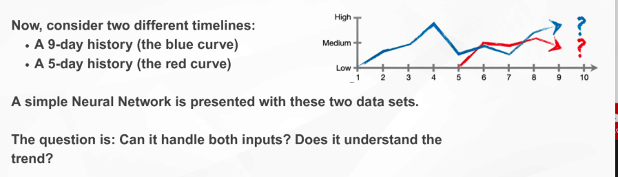

a Recurrent neural network has a loop that passes the information of the previous stage to the current stage creating a memory of past inputs like sequential logic circuit 

### Key Components of RNNs
1. Recurrent Neurons 
    holding a hidden state that hidden state carries information from the past to the next step
    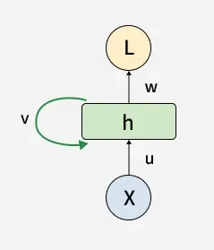

2. Hidden state information (memory)
    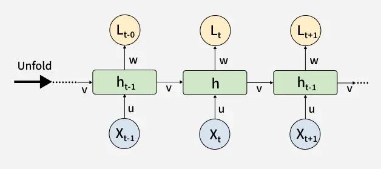 
    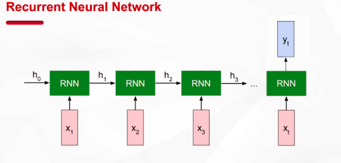

    suppose we have the sequential data
    x₁ → x₂ → x₃ → x₄

    x1 will enter the RNN resulting in the information state h1.
    then h1 and x2 will enter the RNN resulting in h2

    then h2 and x3 will enter the RNN resulting in h3 and going like that 

    current input
      +
    previous memory
        ↓
        RNN
        ↓
    new memory

    ht​=f(xt​,ht−1​)
    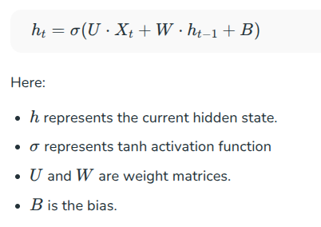

    so the current state h is built by previous state and information about current input and it's weights/biases 
    so as you move forward you keep the  summery of weights and biases of previous inputs into consideration .

3. Recurrent Neural Network architecture 
    Same RNN parameters are reused at every time step so that the previous inputs/hidden states makes sense for next ones 

    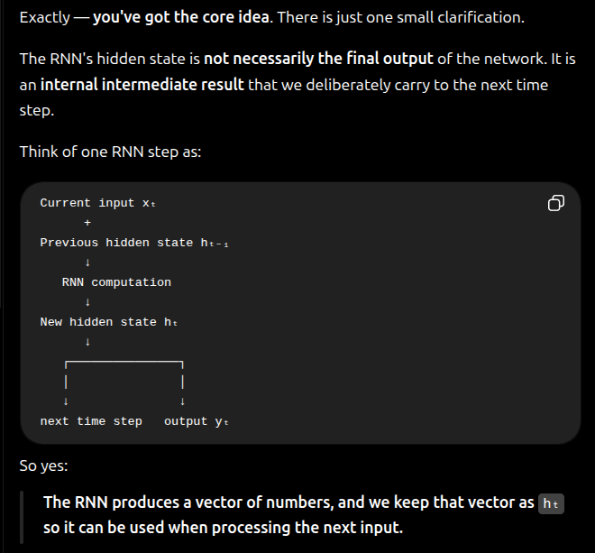

    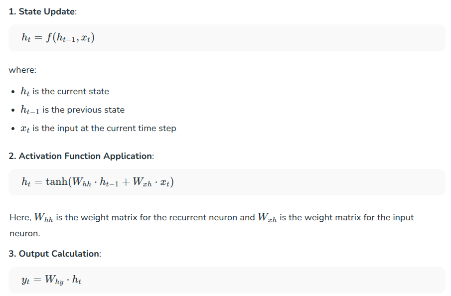

4. Back-propagation Through Time (BPTT) in RNNs
    since every h depends on the previous one . if the final prediction is wrong the error can be related to an information state that was completely wrong (h5 between 20 states).
    h20 depends on h19 , h19 depends on h18,.....h2 depends on h1 .

    to visualize the process we use the above visualization of treating the RNN as multiple neural networks repeated across time rather than one loop. (an RNN has the same weights at all time steps).

    in a normal neural network with 3 layers where dW3 is the weights of the output layer , and dh3 are the outputs the loss function is determined like this .
    dl/dW3 = dl/dh3 * dh3 / dW3  

    since it's the same weights in RNN
    dl/dw = dl/dh3 * dh3/dw 

    how much does loss changes when h3 changes * how much does h3 changes when weight changes .
    
    dh3/dw . how much does h3 changes as weight changes 
    h3 changes as weight changes due to two components h1 and h2 to it's like a tree 
    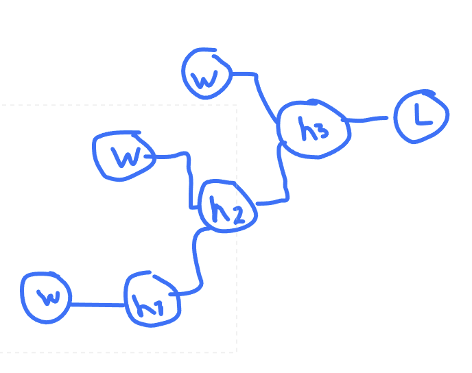

    so the weights affect h3 through two paths . directly and through h2 
    represented by this equations
    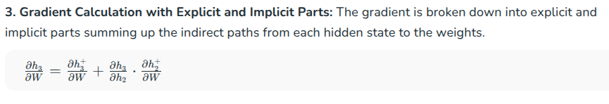
    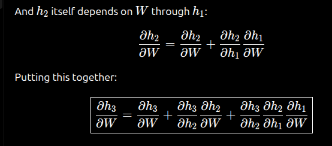
    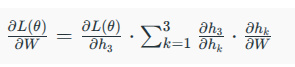

### Types of Recurrent Neural Network
1. One-to-One
    ._. that's just a neural network , no sequential data
    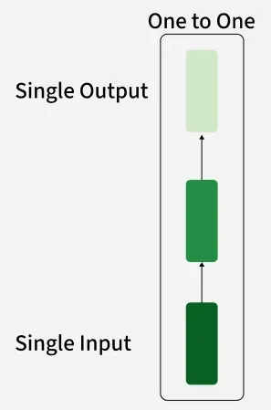

2. One-to-Many 
    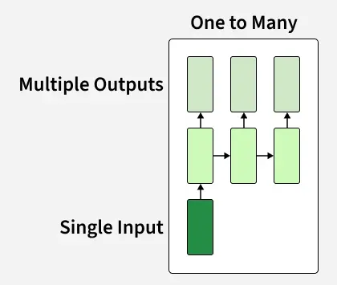
    Processes a sequence of outputs from a single input (like an image) . the model generates a sequence like an image description .

    keeps passing the input and the extra information found to build upon until the stop token(a learned signal the model itself produces when it decides it can no longer learn anything else)
    so it learns something . keep what it learnt then go through the network again
    guess it's the same as actually making the network longer layer-wise
    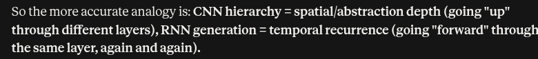

3. Many-to-one 
    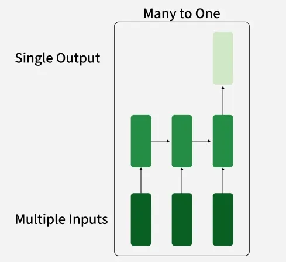
    The type we've been discussing so far.
    sequential input producing one final output using the final hidden state which contains the learnt information to decide upon 
    this is useful for things like sentiment analysis where you get a text "feedback" as a sequence of words and decide "positive"  , "negative"

4. Many-to-many 
    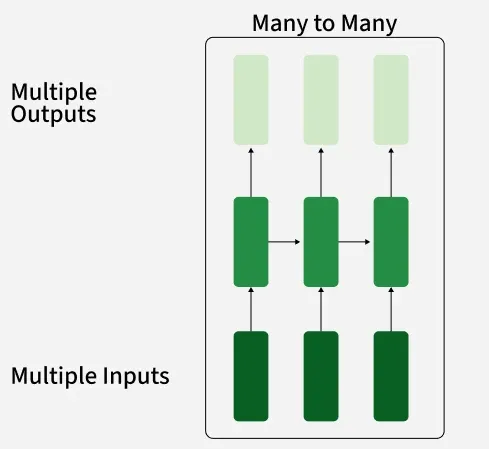
    each intermediate hidden state is used to produce output normally .
    in Different-length many-to-many it's not necessary that each hidden state gets an output (output length != input length)

5. Sequence to Sequence
    Combining multiple types of RNNS where the output of the nth layer matches the n+1th layer excepted input
    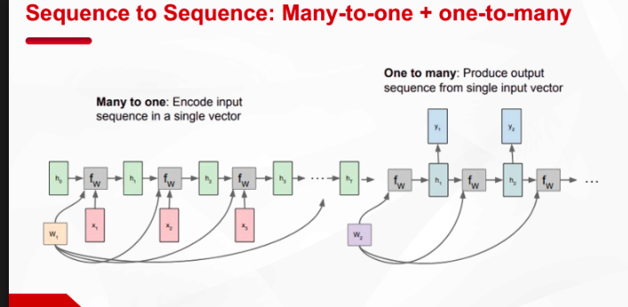

### Searching for interpretable Cells
- We know that each hidden state is a vector 
- a RNN can have like 200 hidden states/vectors describing it's state through different timestamps .
    
#### Cell
- a cell is a component of the state vector . by observing all the vectors you can see how this cell value changes as the RNN learns new information 
- for example if a cell represents how positive the positive the input is 
- 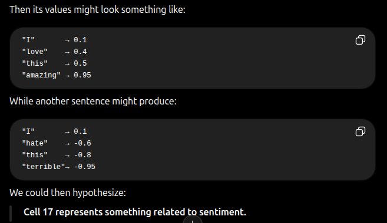

- since we don't really set the meaning or what each cell corresponds to . when looking at the whole hidden states vector we still can interpret something  by observing . and i wouldn't be surprised if that corresponds to some explainable AI method which tries to find correlation / information by how the cell progress .

- "Is there a particular neuron whose activation strongly correlates with some recognizable concept?"

- information can be distributed across many neurons -> this group of neurons moves in an explainable way as it learns this type of information .

##### Example of Cells 
1. Quote Detection Cell 
    Cells that corresponds to the text being inside quotation marks .

2. Line Length Tracking cell
    a cell may correspond to the indention before the words - useful for things like python scripts 

3. If Statement cell
    a cell may correspond to being inside blocks like in C languages like if , while and such 

### Advantages 
1. Processes any length input
    since you can input one-to-/ or many-to-/ with sequential data
    The model size doesn't increase for longer inputs - just more tokenizing is done 

2. Uses info from many steps back 

3. Symmetrical 
    Same weights are applied on every timestep . while it's a must it's still an advantage that the number of parameters needed to tune decrease heavily .

4. Enhanced Pixel Neighborhoods: 
    RNNs can be combined with convolutional layers to capture extended pixel neighborhoods improving performance in image and video data processing.

### Disadvantges 
1. Slow 
    Recurrent computation is inherently sequential so no parallel/GPU 

2. Difficulty accessing information from many steps back 
    in practice 

3. Vanishing Gradient 
    as this equation stated 
    
    components with multiple multiplications like the 3rd term end up being very small if even one of gradients is very small or all are fractions .

    so assume you've 100 steps . steps after like 20 aren't really contributing to the change in weights changing since they are multiplied by all ones above it . and if they're small then it's essentially 0 

    if the weight update is almost nothing the model decides it learnt even if it didn't yet or because it's flawed due to earlier hidden states that can't "say" "that they need weights updated"
    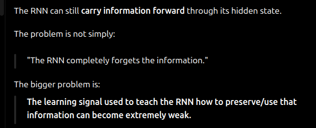

4. Exploding Gradients 
    Same problem as the vanishing gradient problem but this occurs when the values are >1 and they're multiplied the weights end up updating aggressively 

### LSTMs (long short-term memory) [https://www.geeksforgeeks.org/deep-learning/deep-learning-introduction-to-long-short-term-memory/]
- introduced to solve the problem with vanishing gradients , that as time progresses the network struggles to preserve important earlier information .

#### Main idea
instead of having one hidden state , an LSM has two states
ht , hidden state
Ct , cell state . each cell state is connected to the other by three gates that let's it decide to keep , forget or add this new information .
each gate produces a value between 0 and 1 usually using the sigmoid function .
so it's not a binary switch , it's a soft gate

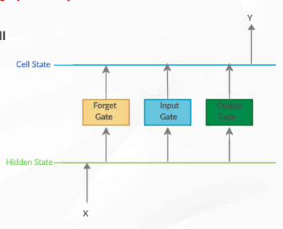
    1. Forget Gate 
        Decides what old information should it remove using current input and previous hidden state to determine how relative is the previous information to the current input .
        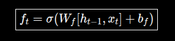
        Wf represents a learned weights matrix 

        ht-1,xt represents the concatenation of the current input and previous hidden state
        Wf . [ht-1 , x] is the sae as Wfh . ht-1 + Wfx . xt

        so the matrices are also concatenated and since it's 1 row , 1 col so it's basically the same .
        since Wf is a learnable matrix , it doesn't have a forced weights but it realistically ends up "i think" removing memory when input is irrelevant to old memory . like that a new topic started so you no longer need old memories .

    2. Input Gate
        How much of the new information should be written to the cell state.
        uses another learnable matrix also 

        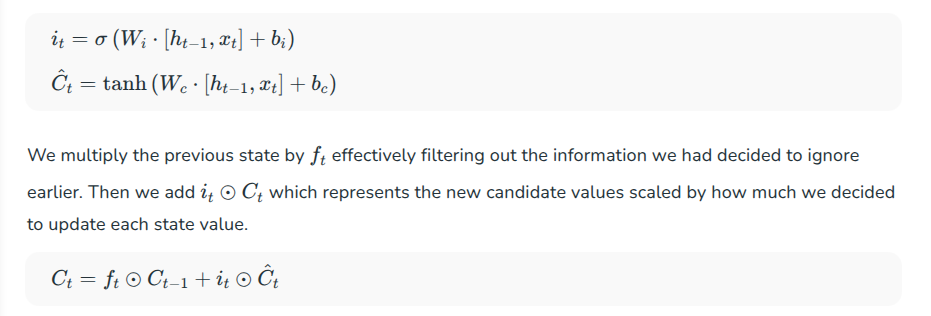
        Ct" is the list of candidates 
        The input gate it decides how much of each candidate value should actually be stored acting like a filer
        while Ct is the resulting long-term memory 
        
        -- for example 
            candidate:
            C̃t = [0.7, 0.9, -0.4, 0.6, 0.2]

            input gate:
            it = [0.1, 0.8, 0.3, 0.95, 0.05]

            [0.1 × 0.7,
            0.8 × 0.9,
            0.3 × -0.4,
            0.95 × 0.6,
            0.05 × 0.2]
                = [0.07, 0.72, -0.12, 0.57, 0.01]
            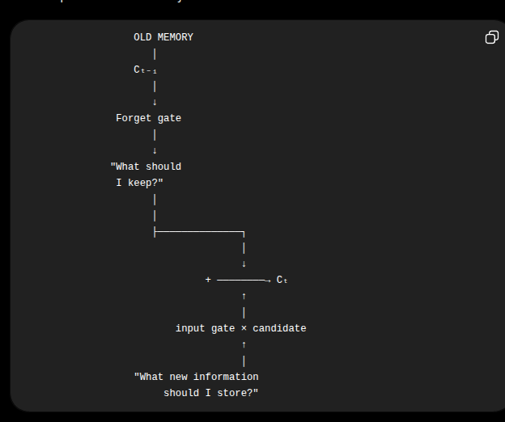 so the candidates list contains information that may be useful. . it's then evaluated by the input gate to decide which information really matters to be added to the cell state .
            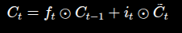
            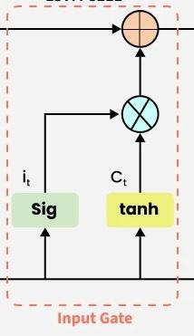

    3. Output Gate
        determines which information from the current cell state should be passed as the hidden state (output) at the current time step using the current input and previous hidden state 
        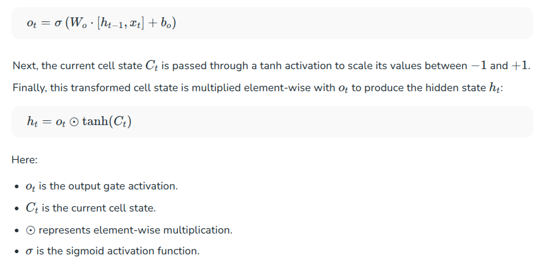
        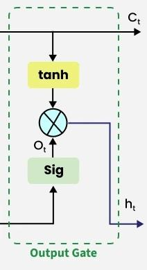

                            ┌── Forget ──→ remove old information
                            │
        Previous memory ────┼── Keep ─────→ preserve information
                            │
        Current input ──────┼── Add ──────→ store new information
                            │
                            └── Output ───→ expose information

#### Strengths 
- Almost always outperforms vanilla RNNs due to avoiding the vanishing gradients problems
- Captures long-range dependencies well , guess since only important information is kept the model can focus on them easily and useless irrelevant information are forgotten rather than kept around  [logically not mathematically]

#### Issues 
- more weights , every gate has at least two learned matrices .
- due to more weights you need more data to train upon to avoid under-fitting 
- can still suffer from vanishing/exploding gradients 
- slow , due to this increased number of parameters and your process is still sequential . think you can except x2~x3 the original time considering the number of added matrices and calculations 

### Types of RNNS
seems logical elsra7a ._.